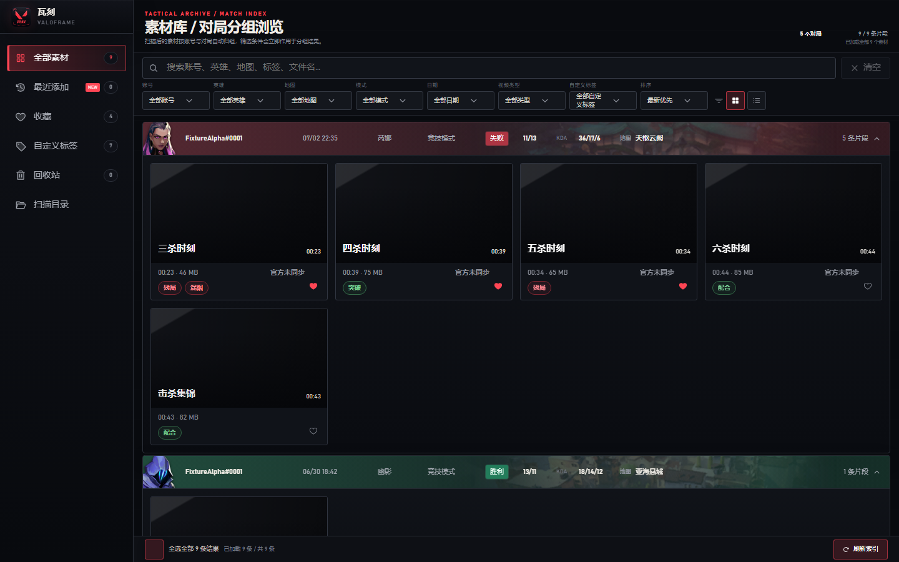

<p align="center">
  
</p>

<h1 align="center">瓦刻 · VALOFRAME</h1>

<p align="center">把散落在本机的无畏契约高光，整理成可搜索、可预览、可标注的对局素材库。</p>

<p align="center">
  <a href="https://github.com/2424521842/valoframe/actions/workflows/ci.yml"></a>
  <a href="LICENSE"></a>
  
  <a href="https://github.com/2424521842/valoframe/releases/tag/v0.1.0-beta.1"></a>
</p>

<p align="center">
  <a href="https://github.com/2424521842/valoframe/releases/download/v0.1.0-beta.1/VALOFRAME-v0.1.0-beta.1-x64-unsigned-setup.exe"><strong>下载 Windows 安装包</strong></a>
  ·
  <a href="https://github.com/2424521842/valoframe/releases/tag/v0.1.0-beta.1">查看 v0.1.0-beta.1 发布说明</a>
</p>

## 下载

当前版本：[`v0.1.0-beta.1`](https://github.com/2424521842/valoframe/releases/tag/v0.1.0-beta.1) · Windows 10/11 x64 · Community Beta

- **GitHub（推荐）**：[下载 `VALOFRAME-v0.1.0-beta.1-x64-unsigned-setup.exe`](https://github.com/2424521842/valoframe/releases/download/v0.1.0-beta.1/VALOFRAME-v0.1.0-beta.1-x64-unsigned-setup.exe)（6.84 MB）
  - SHA-256：`a4993e5152cddc42623b4fe7dc308100f142617765ddad36aab66ae8aeb40d08`
- **蓝奏云（备用）**：[下载 `瓦刻_0.1.0_x64-setup.exe`](https://wwbfc.lanzoue.com/iYmie3y080ef)（密码：`4sj6`，6.83 MB）
  - SHA-256：`3e8bc3692119a8f2c2e32fc4c46928e37cbfa40e6efeeafbc0060c7aac79ef74`

> [!IMPORTANT]
> 普通用户只需下载上面列出的 `.exe` 安装包。Release 页中的 `Source code`、FFmpeg 压缩包、许可归档、JSON 报告、校验清单等是源码或技术合规附件，不是安装包。两个下载入口目前对应不同文件，请按所选入口的文件名和 SHA-256 分别核验，不要混用校验值。

> [!WARNING]
> v0.1.0 Community Beta 是未签名的早期测试版本，Windows 可能显示“未知发布者”或 SmartScreen 警告。只从项目明确公布的入口下载并核对 SHA-256；该版本没有自动更新，也不等于严格正式发布批准。安装前请阅读 [Community Beta 说明](docs/COMMUNITY_BETA.md)。

> [!NOTE]
> 这是非官方社区项目，与 Riot Games、腾讯及其关联公司不存在隶属、赞助或认可关系。发布负责人已确认当前清单锁定的游戏图片可以随 v0.1.0 Community Beta 发布；这是项目负责人的渠道决定，不声称第三方批准或独立法律审核已经完成。记录见 [Community Beta 决定](release/approvals/community-beta-v0.1.0.json)、[本版本素材范围](release/approvals/community-beta-v0.1.0-game-content-scope.json)和[原有游戏素材记录](release/approvals/game-content-rights.json)。

<p align="center">
  
</p>
<p align="center"><sub>合成账号与对局数据 · 不含真实玩家信息或本地路径</sub></p>

## 它解决什么问题

无畏契约高光往往散落在多个目录，文件名很难说明它属于哪个账号、对局或精彩时刻。瓦刻在本机完成索引，把素材按账号与对局自动归组，再提供搜索、筛选、预览和整理能力。

`本地来源 → 只读扫描 → 元数据合并 → 账号/对局归组 → 搜索与预览 → 收藏、标签、备注和导出`

- **自动归档**：发现默认、手动和固定磁盘来源，合并 WonderfulDb、导出 JSON、`highlight.log` 与 LevelDB 元数据；单路失败时仍可降级入库。
- **快速找片**：按账号、英雄、地图、模式、日期、视频类型、自定义标签和文件状态筛选；大素材库使用后端分页与虚拟化。
- **本地优先**：应用不提供云同步或遥测，素材、索引和用户整理数据留在本机。依赖安装与 WebView2 引导可能访问各自的官方服务。
- **默认不改原片**：扫描、预览、收藏、标签、备注和普通回收操作不修改原始视频；只有在应用回收站再次明确确认“永久删除”时，才会尝试删除所选文件。

## 当前状态

| 通道 | 状态 | 适用范围 |
| --- | --- | --- |
| 浏览器界面预览 | 可用 | 使用合成 mock 数据体验素材库、扫描、标签和详情；不访问真实本地素材 |
| 桌面源码运行 | 内部测试 | 可验证真实扫描与本地预览；必须从干净提交构建并记录 commit |
| Community Beta | [v0.1.0-beta.1 已发布](https://github.com/2424521842/valoframe/releases/tag/v0.1.0-beta.1) | GitHub Prerelease；未签名、无自动更新，下载后需核对对应 SHA-256 |
| 严格正式发布 | 阻断 | 代码签名、可信时间戳、完整许可审阅、干净 VM 与数据安全证据等门禁尚未全部闭合 |

Community Beta 的下载要求、Windows 警告、手动更新方式、游戏图片说明及 FFmpeg 许可/对应源码要求见 [Community Beta 说明](docs/COMMUNITY_BETA.md)。FFmpeg 只用于生成缩略图；发布集合必须同时提供其许可证材料与对应源码。

## 安装

1. 从上方任一明确入口下载对应的 `.exe`，不要把 `Source code` 或技术附件当作安装程序。
2. 在 PowerShell 中运行 `Get-FileHash -Algorithm SHA256 -LiteralPath '.\安装包文件名.exe'`，确认结果与该入口公布的 SHA-256 完全一致。
3. 双击安装。如果 Windows 显示“Windows 已保护你的电脑”，先确认来源和哈希，再选择“更多信息”→“仍要运行”；无法确认时请取消安装。
4. 首次扫描前建议备份重要数据。此版本不会自动更新，新版本需要手动下载安装。

## 快速体验

### 1. 浏览器界面预览

适合查看界面和交互，不会扫描真实目录，也不能验证视频播放、目录选择或导出：

```powershell
npm ci
npm run dev
```

随后打开 `http://localhost:1420`。

### 2. 桌面开发模式

Windows 环境需要 Node.js 24、npm 11、Rust 1.96.1 MSVC、Visual Studio C++ Build Tools 和 Microsoft Edge WebView2 Runtime：

```powershell
npm ci
npm run tauri -- dev
```

从源码运行时未提供受审 FFmpeg 资源会稳定降级为占位缩略图；请不要自行把来源不明的 FFmpeg 二进制加入仓库或测试包。

## 小范围测试

当前只接受两类测试：

1. 使用合成数据的浏览器界面预览；
2. 负责人或同一法律主体控制设备上的桌面源码/内部 RC 验证。

每次测试都必须绑定唯一 commit、构建方式和 Windows 环境；永久删除只允许使用专门复制出的可丢弃素材。详细矩阵、停止条件和脱敏要求见[小范围测试指南](docs/INTERNAL_TESTING.md)。

- [提交测试记录](https://github.com/2424521842/valoframe/issues/new?template=beta_feedback.yml)
- [报告可复现问题](https://github.com/2424521842/valoframe/issues/new?template=bug_report.yml)
- [阅读本地数据与隐私说明](docs/PRIVACY.md)
- [报告安全问题](SECURITY.md)

提交反馈时不要上传原始视频、应用数据库、完整日志、真实路径、玩家名、OpenID、对局 ID、备注或未经脱敏的截图。

## 文件与数据安全

- WonderfulDb 以只读方式打开并在内存中解密，但用于索引的部分原始 snapshot/event 记录会以明文 JSON 持久化到应用 SQLite；数据库未由应用额外加密。完整说明见[本地数据与隐私](docs/PRIVACY.md)。
- “移入回收站”只改变索引状态，可恢复；“永久删除视频”是不可撤销的本地文件操作，并要求再次确认。
- 数据库迁移前会创建经校验的备份；故障处理见[数据库恢复指南](docs/DATABASE_RECOVERY.md)。
- 在干净 VM 和真实数据安全证据完成前，不应把唯一副本用于测试删除、升级或卸载流程。

## 开发与验证

前端：

```powershell
npm test
npm run build
```

Rust 后端：

```powershell
cargo fmt --manifest-path src-tauri/Cargo.toml -- --check
cargo clippy --manifest-path src-tauri/Cargo.toml --locked --all-targets --all-features -- -D warnings
cargo test --manifest-path src-tauri/Cargo.toml --locked --all-targets --all-features
```

GitHub Actions 使用同一组基础门槛，配置见 [`.github/workflows/ci.yml`](.github/workflows/ci.yml)。Windows 内部 RC 还有独立的 FFmpeg、许可证据、bundle 静态检查和启动烟测；这些检查通过不代表公开分发获批。

本地英雄/地图图必须与固定清单逐字节一致：

```powershell
npm run assets:verify
```

## 技术栈

- Tauri 2 + Rust
- React 19 + TypeScript
- SQLite via `rusqlite`
- Vite + Vitest + Node.js test runner

## 项目边界

瓦刻不实时录制，不读取游戏进程或内存，不绕过文件权限，也不上传素材或索引数据。当前功能边界见 [PRD](docs/PRD.md)，技术实现见[架构文档](docs/ARCHITECTURE.md)。

## 文档

- [小范围测试](docs/INTERNAL_TESTING.md)
- [Community Beta 说明](docs/COMMUNITY_BETA.md)
- [本地数据与隐私](docs/PRIVACY.md)
- [PRD](docs/PRD.md)
- [Architecture](docs/ARCHITECTURE.md)
- [Data Model](docs/DATA_MODEL.md)
- [Metadata Ingestion](docs/METADATA_INGESTION.md)
- [Roadmap](docs/ROADMAP.md)
- [Tasks](docs/TASKS.md)
- [Windows Release](docs/RELEASE.md)
- [Windows Release Checklist](docs/WINDOWS_RELEASE_CHECKLIST.md)
- [Licensing Scope](docs/LICENSING.md)
- [Third-party License Review](docs/THIRD_PARTY_LICENSE_REVIEW.md)
- [GitHub Repository Setup](docs/GITHUB_REPOSITORY_SETUP.md)

## 许可与权利声明

项目自有源代码和随附文档采用 [MIT License](LICENSE)。第三方依赖、FFmpeg、游戏内容、名称、商标、品牌图标及其他非项目自有素材不因此获得 MIT 授权，详见[许可范围说明](LICENSE-SCOPE.txt)与[许可文档](docs/LICENSING.md)。

本项目旨在作为免费、非商业的社区工具开展，并参考 Riot Games 的 [Legal Jibber Jabber](https://www.riotgames.com/en/legal)。该网页本身不构成授权。发布负责人已确认清单锁定的 42 张游戏图片可以随 v0.1.0 Community Beta 发布；该决定不声称 Riot Games、腾讯或其他第三方批准，也不声称独立法律审核已经完成。Community Beta 不用于商业分发或第三方复用，并且不等于严格正式发布批准。VALORANT、《无畏契约》及相关名称、商标和游戏内容归其各自权利人所有。
