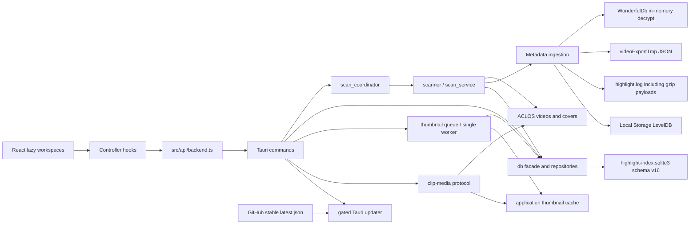

# Architecture

本文描述当前生产实现，不再混用早期 `assets`、`start_scan`、`DetailPanel` 等目标命名。数据表、command 和组件名称均以当前源码为准。

## 1. 系统总览

瓦刻（VALOFRAME）是 Tauri 2 桌面应用。React 负责素材库、扫描、标签、预览和设置中心；Rust 负责只读发现 ACLOS 文件、合并本地元数据、维护 SQLite 索引、后台缩略图队列、受限媒体协议和签名稳定更新。



核心边界：

- ACLOS 视频、封面和元数据目录在扫描、预览和常规整理中只读；只有回收站的显式永久删除命令会删除所选视频。
- 自动生成的 JPEG 只写应用缩略图缓存；生成状态和安全 basename 写入 SQLite，不复用或覆盖源 `cover_path`。
- 用户的收藏、卡片审核决定、标签、备注、回收状态和索引只写入应用 SQLite。
- WonderfulDb 账号文件只读，以 openid 派生密钥在内存中完成 AES-256-CBC 解密；不会写出一个解密后的 WonderfulDb 文件，但归一化字段和部分 snapshot/event 原始记录会以 `raw_json` 明文保存到应用 SQLite，详见[本地数据与隐私](./PRIVACY.md)。
- 稳定账号身份来自 WonderfulDb/openid、match account ID 或来源账号 ID；玩家名仅用于展示和搜索。
- 单个来源或元数据文件失败应形成有界扫描错误摘要并继续处理其他来源。

## 2. Rust 后端

| 模块 | 当前职责 |
| --- | --- |
| `lib.rs` | 初始化单实例保护和 Tauri、注册 `clip-media`、迁移数据库、恢复中断扫描/删除意图、管理扫描与缩略图协调器并注册 commands |
| `commands.rs` | ping、扫描任务/磁盘发现、进度取消和缩略图 command 的聚合入口 |
| `commands/sources.rs` | 来源注册/重叠确认、启停、单来源同步、启用来源批量同步、启动异步同步，以及来源根重新定位的预览/提交编排 |
| `commands/library.rs` | 素材分页/详情、来源、标签、收藏、回收、备注、符合资格的单条/批量仅移除索引、媒体令牌及系统文件管理器 commands |
| `commands/media_protocol.rs` | 通过 clip ID 查询最新路径，处理源/生成封面、HEAD、Range 和最多 1 MiB 的媒体响应 |
| `thumbnail.rs` | 解析受控 FFmpeg、单 worker、超时/取消、指纹提交、事件和缓存维护 |
| `app_updates.rs` | 固定稳定端点、公钥装配、检查/下载/取消/安装状态机、签名错误映射和发布说明约束 |
| `critical_tasks.rs` | 用 RAII lease 互斥扫描、永久删除、来源根重新定位和更新安装，错误/panic 后自动释放 |
| `scan_coordinator.rs` | 保证同一时刻只有一个扫描任务，维护 job ID、进度、取消和终态 |
| `scanner.rs` | 文件索引、封面匹配、元数据摄取、missing 判定和扫描批次统计 |
| `scanner/scan_service.rs` | 默认、自定义、多根和发现结果的统一扫描编排 |
| `scanner/recursive_mp4.rs` | NVIDIA、Tracker、generic 的有界递归 MP4 枚举、稳定性/边界检查、分批 upsert 与安全 missing 判定 |
| `scanner/reconnect.rs` | 扫描候选的普通文件/reparse/根边界校验、最佳努力文件身份读取和 TEMP 重连计划生命周期 |
| `scanner/scan_runs.rs` | scan-run 生命周期、终态兜底、有界错误解析和批次摘要持久化 |
| `drive_discovery.rs` | Windows 固定磁盘枚举、受控目录遍历、候选来源验证和去重 |
| `db.rs` | 数据库路径、迁移/普通/只读连接、写入与元数据修复入口、公共 repository facade 和自然名称排序 |
| `db/migrations.rs` | schema v16 建表及 v13/v14/v15 安全迁移；维护来源/审核、文件身份、路径别名去重、扫描摘要可用性、本人死亡事件字段、索引、触发器、回收身份快照和删除意图 |
| `db/models.rs` | command 与 repository 共用 DTO；来源类型、扫描模式和卡片审核结果使用封闭枚举 |
| `db/repositories/library.rs` | legacy 列表、分页摘要、全库 facets、筛选排序、行映射和批量事件/标签装配 |
| `db/repositories/reconnect.rs` | 同一来源内 path/稳定身份/旧指纹的双侧唯一匹配，TEMP staging 后保守原地重连并协调缩略图指纹 |
| `db/repositories/relocations.rs` | 来源根预览、可信匹配、冲突/受保护状态检查和事务内两阶段路径重写 |
| `db/repositories/*` | clips、删除意图、sources、tags、thumbnails 与仅移除索引的查询和事务写入 |
| `file_identity.rs` | 复用永久删除所需的 Windows 卷序列号与文件索引只读能力；普通索引读取失败时安全降级为空身份 |
| `wonderful_db.rs` / `wonderful_ingest.rs` | 官方 match/video 解密归一化、clip 匹配和视频时间线写入 |
| `metadata.rs` | `videoExportTmp/config-*.json` 容错解析 |
| `highlight_log_parser.rs` | 明文及 gzip 日志 payload 解析，按 GameID 分局，并以账号、当前玩家身份、结算总分和连续回合共同确认单回合官方评分 |
| `leveldb_reader.rs` / `metadata_ingest.rs` | LevelDB 快照读取及对局级回退合并 |

数据库生命周期明确分离：

1. 应用启动时 `initialize_database` 创建目录并调用 `migrate_database`；拒绝未来 schema，迁移前后运行完整性检查，旧版本升级前创建经校验的在线备份。
2. schema 变更与版本号在一个 `IMMEDIATE` 事务中提交；失败时全部回滚。启动错误通过原生恢复提示暴露数据与备份目录，不静默覆盖数据库。
3. 数据库可用后先终结上次异常退出遗留的扫描，并恢复已持久化的永久删除意图，再启动缩略图 worker 和主窗口。
4. 普通写请求使用 `open_database`，不会执行 schema 初始化。
5. 列表、详情、来源、facets 和媒体路径查询使用短生命周期只读连接。
6. 媒体协议在关闭数据库连接后再读取文件，不把 SQLite 连接保持到流式响应结束。
7. 所有连接使用 `WAL + synchronous=FULL`；永久删除授权提交必须在触碰文件前具备断电耐久性。

## 3. React 前端

| 模块 | 当前职责 |
| --- | --- |
| `App.tsx` | 页面路由、筛选组合、全局刷新、通知和 controller 组合 |
| `screens/LibraryWorkspace.tsx` | 素材库、选择、批量操作和加载更多入口 |
| `screens/ScanWorkspace.tsx` | 来源队列、逐来源新鲜度/7 天提醒、根重新定位入口、全电脑发现、进度、取消和带新增数量的扫描结果 |
| `components/SourceRelocationDialog.tsx` | 新根选择、只读预览、可信匹配/冲突展示、二次确认和提交后同步结果 |
| `components/SourceWizardDialog.tsx` | 四种来源类型、目录授权、显示名、启动同步策略和重叠来源二次确认 |
| `screens/TagManagementWorkspace.tsx` | 标签统计、搜索、创建、修改和删除 |
| `screens/PreviewWorkspace.tsx` | 按需详情、媒体播放、本人击杀/本人死亡时间轴、标签和备注 |
| `screens/SettingsWorkspace.tsx` | 常规、素材库、播放、更新、数据与隐私和关于分类；承载完整更新状态机与安全确认 |
| `lib/appPreferences.ts` / `hooks/useAppPreferences.ts` | 严格校验 `valoframe.preferences.v1`，同步恢复前端偏好，并在存储不可用时降级为会话内状态 |
| `services/appUpdater.ts` | 五个受控 updater application command 的唯一前端适配层 |
| `hooks/useAppUpdaterController.ts` | 每日自动检查限频、手动检查、下载/取消/安装状态机和错误展示策略 |
| `hooks/useClipPageController.ts` | 分页、generation 隔离、跨页去重和失败重试 |
| `hooks/useClipDetailController.ts` | 按需详情、请求令牌和最多 6 项 LRU 缓存 |
| `hooks/useClipMutationController.ts` | 单条及批量收藏、标签、回收和摘要 patch |
| `hooks/useLibraryFacetsController.ts` | 全库精确聚合，不从已加载页面推导筛选项 |
| `hooks/useScanController.ts` | 扫描事件监听、按 job ID 终态去重/摘要恢复、新增数量格式化、状态恢复、互斥错误和终态刷新 |
| `lib/scanFreshness.ts` | 把 ISO UTC 来源时间映射为本地自然日，生成首次/今天/N 天状态及过期来源汇总 |
| `hooks/useTagController.ts` | 标签加载与 mutation |
| `hooks/useThumbnailController.ts` | 按已加载页面批量 ensure、单事件订阅、ready revision 去重和显式重试 |
| `components/MatchLibrary.tsx` | 顶层对局组与极端单组视觉行分层虚拟化、分页触底和键盘交互 |
| `components/ThumbnailImage.tsx` | 封面协议错误的局部回退和新 revision 重试 |

五个 workspace 使用 `React.lazy` 按页面拆包。生产入口不再引用旧 `ClipGrid`、`DetailPanel`、`SourceSidebar` 等组件。

## 4. Command 契约

生产前端使用的主要 commands：

| 类别 | Commands |
| --- | --- |
| 扫描与来源 | `register_scan_source`、`set_scan_source_enabled`、`sync_scan_source`、`sync_enabled_sources`、`preview_scan_source_relocation`、`relocate_scan_source`、`scan_default_aclos_dir`、`scan_roots`、`discover_and_scan_fixed_drives`、`get_scan_status`、`cancel_scan`、`get_scan_summary`（可按 job ID） |
| 素材读取 | `list_clip_page`、`get_library_facets`、`get_clip_detail`、`list_sources` |
| 标签 | `list_tags`、`create_tag`、`update_tag`、`delete_tag` |
| 素材写入 | `set_clip_favorite`、`set_clips_favorite`、`set_clip_trashed`、`set_clips_trashed`、`remove_clip_from_index`、`remove_clips_from_index`、`delete_clips_permanently`、`update_clip_note` |
| 标签绑定 | `add_tag_to_clip`、`add_tag_to_clips`、`remove_tag_from_clip`、`remove_tag_from_clips` |
| 缩略图 | `ensure_clip_thumbnails`、`retry_clip_thumbnails`、`get_thumbnail_status` |
| 文件与媒体 | `get_clip_media`、`open_clip_externally`、`open_clip_location`、`copy_clip_path` |
| 稳定更新 | `get_app_update_runtime_info`、`check_for_app_update`、`download_app_update`、`cancel_app_update_download`、`install_app_update` |

`list_clips`、`scan_custom_dir` 和 `ping_backend` 暂时保留兼容契约，但生产素材库不再依赖 `list_clips`。

`delete_clips_permanently` 只接受 `file_status = 'trashed'` 的记录。命令先持久提交不可变删除授权，再通过 Windows 文件身份与同一受控句柄校验并删除目标，最后原子移除 intent 与索引；来源离线或暂时占用时保留待重试 intent，身份替换或路径越界时取消旧授权并返回不可重试阻断，绝不把授权静默扩展到替换文件。

### 4.1 列表、facets 与详情

- `list_clip_page` 默认返回 50 条，允许范围为 1–200；所有筛选在后端执行。
- 普通浏览保持 50 条增量分页；用户明确执行“全选全部结果”时，前端用 200 条页面顺序补齐同一查询，再建立完整 ID 选择，加载失败时不提交半完成的全选状态。
- 搜索字段之间是 OR，不同筛选维度之间是 AND；SQL 使用参数绑定并转义 LIKE 元字符。
- count、当前页和页内标签在同一只读快照中读取；标签批量加载，不产生 N+1。
- 五种排序均追加 clip ID tie-breaker；文件名排序使用数字感知 collation。
- `ClipSummary` 包含卡片/分组所需的稳定账号、来源路径与来源类型、相对目录、审核结果、战斗分、状态和轻量标签 ID，不包含备注、OCR、raw JSON 或事件。
- `get_clip_detail` 只加载一个完整 Clip、完整 Tag 对象和该 clip 自己的事件；不存在时返回稳定 `clip-not-found` 错误。
- `get_library_facets` 针对整个索引统计账号、来源、英雄、地图、模式、自定义标签、视频类型、状态和大小范围。

### 4.2 批量操作

批量收藏、标签和回收均由单个后端 command 在一个事务内执行。输入 ID 会去重，结果报告匹配和缺失数量；中途失败回滚整个批次。前端只在操作影响当前筛选条件时重置一次分页。

## 5. 运行时数据流

### 5.1 启动

1. 单实例插件先拦截重复启动；主进程执行一次 schema v16 初始化或 v13/v14/v15→v16 迁移。
2. 后端把异常遗留的 running/cancelling 扫描收敛为 failed，并恢复持久化的永久删除意图。
3. 后端恢复中断的缩略图任务、清理受控缓存并启动一个 worker；找不到受控 FFmpeg 时把待处理队列一次性标为 unavailable。
4. React 加载第一页、全库 facets、来源 DTO 和标签，并按页面批量 ensure 缺失缩略图。
5. 主界面就绪后异步读取 updater 运行时信息；稳定构建在每日限频允许时非阻塞检查，错误不影响本地启动。
6. 主窗口显示后，后端把全部 `enabled` 持久来源规范化去重并异步提交一个合并扫描任务；该任务不阻塞首屏，仍受全局扫描互斥和取消协议约束。没有启用来源时不扫描；若同类合并扫描刚在 10 分钟内进入终态，则仅跳过这次快速重启触发，防止异常重启风暴反复全量提交。正常启动语义不变，用户手动同步不受该冷却影响。

### 5.2 持久来源与多根扫描

1. 来源向导把用户授权目录规范化并拒绝重解析点；完全重复路径复用现有来源，父子目录重叠必须显式二次确认。ACLOS 可从一个根发现多个 `wonderfulVideos*` 逻辑来源，NVIDIA、Tracker 和 generic 各自保存一个递归来源。
2. 启动同步、`sync_enabled_sources` 和 `sync_scan_source` 都复用 `scan_coordinator`、同一个 scan job/run 协议与关键任务互斥；已有任务时返回稳定 `already-running`，不会并发启动第二个扫描。
3. `aclos-structured` 只处理来源根直放 MP4 或一层对局目录，并读取 WonderfulDb/导出 JSON/日志/LevelDB；`recursive-mp4` 只读取用户根内大小写不敏感的普通 `.mp4`，不读取第三方插件数据库，也不伪造对局元数据。
4. 递归适配器采用深度/文件数上限和 128 项短事务批次，跳过符号链接、junction/reparse point、越界 canonical path 和扫描期间大小/mtime 变化的文件；同一规范化文件路径只能归属一个来源。
5. 每个来源先完整枚举并在连接级 TEMP 表统计候选唯一性，再按“规范化路径 → 来源内双侧唯一稳定身份 → 身份全空旧行的双侧唯一文件名/大小/mtime”处理。复制、硬链接或重复指纹不合并；身份读取失败不阻断索引。
6. 扫描按来源和文件推进，以事件上报进度，并在目录、文件和批次边界响应取消。只有来源可访问、枚举完整且未取消时才把本轮未见的历史文件标记为 `missing`；offline、partial、cancelled 均保留历史状态。
7. 终态为 `completed`、`partial`、`cancelled` 或 `failed`；前端从事件、命令结果或状态轮询任一路径看到终态后立即释放 active job/扫描中状态，摘要恢复和索引刷新分别有界执行，不阻塞终态收敛。已安全提交的短事务保留，下一次重扫可幂等修复。只有 completed 完整扫描刷新 `lastScanAt`；终态摘要用 `summary_available` 区分真实“新增 0”与数量不可用，并可按 job ID 恢复。
8. 旧 `scan_roots` 入口保留兼容：v13→v14 历史迁移的 ACLOS 行在 `scan_root_path = path` 时仍以 `wonderfulVideos*` 父目录调用旧发现逻辑；递归来源始终使用自身配置根，不扩大授权边界。

全电脑发现只遍历 Windows 固定磁盘，跳过临时目录、回收站、系统卷和重解析点；候选来源通过 MP4 布局验证后再交给同一多根扫描服务。

schema v14 历史迁移把来源持久化为 `source_kind`、`scan_mode`、`scan_root_path`，并为 clip 保存 `source_relative_dir`；schema v15 增加稳定文件身份和安全重连能力；schema v16 统一普通与 Win32 verbatim 路径并迁移确定性重复索引。来源根丢失时，用户选择新根后先执行只读预览，提交时重新验证并以两阶段占位在单事务中更新来源、clip、分组及根内引用；提交本身不刷新 `lastScanAt`，随后完整同步成功才刷新。M2 已开放 ACLOS、NVIDIA、Tracker、generic 的统一来源 UI；外部来源只根据文件系统摘要整理，不访问 NVIDIA/Tracker 私有状态。

### 5.3 元数据优先级

```text
WonderfulDb clip record
  > video export JSON
  > highlight.log match fields
  > LevelDB battle summary
  > filename/path inference
```

这个优先级按字段和所有权执行。`matches`/`match_stats`/`match_events` 保存整场信息；`clips`/`clip_metadata` 保存视频身份和分类；`clip_segments`/`clip_events` 保存视频自己的组装区间和事件。普通高光以 `segmentStart + eventStart` 计算时间，击杀/死亡集锦把 `eventStart` 视为视频绝对时间；越界事件不裁剪、不渲染并形成元数据警告。单个视频的 `kill_count` 只能由该 clip 的当前玩家击杀事件计算；预览仅显示 `killer_is_me` 的本人击杀和 `killed_is_me` 的本人死亡。视频类型固定为三杀时刻、四杀时刻、五杀时刻、六杀时刻、击杀集锦和死亡时刻；标签表只保存用户创建的标签，标签名称不参与视频类型判断。

### 5.4 媒体

前端只把 clip ID 交给 `clip-media` 协议。每次请求重新从只读数据库查询当前路径，拒绝非 MP4 视频；无 Range 的大文件也只返回首个最多 1 MiB 分段，避免把整个视频读入内存。

`cover/{clipId}?v={revision}` 仍只暴露 clip ID 和缓存版本。协议先返回源目录已有且由扫描器标记为 `file` 的封面；否则只接受 `clip_thumbnails` 中 ready 状态的安全 basename，并在规范化后的应用缓存根内解析。生成封面限制为完整 JPEG 和最多 4 MiB，支持 GET/HEAD，并返回 `nosniff`；物理缓存路径不会进入前端 DTO。

缩略图指纹包含输出版本、规范化视频路径、大小和修改时间。生成完成时，数据库在同一原子条件中再次核对当前 clip 行、指纹、可用状态和源封面状态，扫描期间完成的陈旧任务不能覆盖新状态。前端监听 `thumbnail-progress`，只在 ready revision 变化时局部 patch 已加载摘要、详情缓存和 poster，不刷新分页或重新请求媒体。

## 6. 状态与数据所有权

当前生产写入的主要文件状态：

| 状态 | 含义 |
| --- | --- |
| `available` | 文件存在且未进入应用回收站 |
| `missing` | 历史文件在一次可判定的扫描中未见 |
| `trashed` | 仅数据库中的回收状态，原视频不变 |

`inaccessible` 与 `unsupported` 仍属于查询/兼容契约，但当前扫描器不会把它们作为 clip 的常规持久化终态。

元数据状态包括 `not_found`、`parsed`、`partial`、`failed` 和 `enriched`。来源失败不会删除已有用户数据；对不可访问来源也不会把历史素材误标 missing。

永久删除不把 NTFS 操作伪装成 SQLite 原子事务。素材进入回收站时先写入不可变 `clip_trash_snapshots` 文件身份；用户二次确认后，后端只能从该快照派生并以 FULL 同步语义提交 `clip_delete_intents`，再校验并删除同一文件，最后原子移除 intent 与 clip。崩溃后按持久意图幂等恢复；旧回收记录无快照或目标身份变化时保留 clip 和文件、取消/拒绝旧授权并要求恢复后重新回收确认，不把未知状态当成成功。

缩略图状态由独立表维护，包括 `pending`、`running`、`ready`、`failed`、`unavailable`、`suppressed` 和 `evicted`。源封面或非 available 素材使用 `suppressed`；生成器缺失使用全局 `unavailable`，不会逐素材启动失败任务。

## 7. 安全边界

- 生产 CSP 默认只允许自身脚本和字体；图片仅允许自身、data 和自定义本地媒体协议，不连接第三方美术资源服务。
- `style-src 'unsafe-inline'` 是为 React/Motion 运行时 style 属性保留的显式例外；生产不允许 `unsafe-eval`。
- 开发 CSP 另行允许本机 Vite HMR websocket 和开发脚本能力，不复用到生产。
- 主窗口 capability 只开放事件 listen/unlisten 和目录选择；未使用的 `tauri-plugin-opener` 已删除。
- “打开原位置”通过受控 Rust command 以独立参数调用系统文件管理器，不接受任意 shell 字符串。
- FFmpeg 只从应用资源 `bin/ffmpeg(.exe)` 或绝对路径 `VHM_FFMPEG_PATH` 解析，不搜索 `PATH`，不经 shell 启动；进程有超时、取消和隐藏窗口控制。
- 最小 FFmpeg 运行契约固定验证 H.264、HEVC 和 AV1 解码能力，并分别用合成 MP4 执行受限 MP4→JPEG 烟测；WebView2 无法内嵌解码时，`open_clip_externally` 会重新从数据库取路径并复核 MP4、来源根、canonical 边界及整条 reparse 链后才调用系统默认播放器。
- 缓存清理只处理严格命名的直接文件和陈旧 `.part`，拒绝路径穿越、目录和符号链接，不递归删除未知内容。
- 永久删除只处理回收站内、属于已验证来源且与持久化意图快照一致的 MP4；待删除记录会阻止普通恢复和仅删除索引。
- “仅移除索引”只接受 missing 或来源不可用且没有删除 intent 的普通库素材；它可以删除应用内标签、备注等索引状态，但不调用回收/永久删除文件路径。批量结果逐项报告成功与失败。
- 来源根重定位拒绝 reparse point、越界/重叠根、零可信匹配、回收素材、删除 intent 和关键任务冲突；不会修改不可变回收快照或补造永久删除授权。
- Tauri 单实例插件在数据库初始化前拦截第二个进程；重复启动只恢复、显示并聚焦现有主窗口，不接受外部路径或命令参数。
- updater 原始 plugin commands 不进入窗口 capability；前端只能调用 Rust 固定端点/公钥的受控 commands。未嵌入公钥的 Community Beta 构建拒绝检查且不生成更新产物。
- 当前自定义 application commands 仍使用 Tauri 的默认应用命令可见性；若未来增加远程窗口或多权限窗口，应通过 `AppManifest::commands` 为这些 commands 建立显式 ACL。

## 8. 性能与一致性

- 素材列表采用服务端分页和顶层对局组虚拟化；单组超过 48 条时复用同一滚动容器按视觉行二级虚拟化，不产生嵌套滚动区。
- 组内网格列数来自真实内容宽度；宽度、视图、折叠和跨页素材数量变化会使对应测量缓存失效。多组及单组 1k/10k fixture 的卡片 DOM 均保持有界。
- 快速切换详情使用请求令牌隔离旧响应；备注 mutation 不触发媒体重新加载。
- 跨页分组使用稳定账号 + match key，保持后端顺序并避免重复标题。
- 数据库只在启动迁移；媒体和普通请求不执行建表、检查列或标签初始化。
- 列表与详情分离，避免在大素材库为全部 clips 加载事件。
- 缩略图队列持久化在 SQLite，内存 channel 只合并唤醒信号；一个 worker 有界执行，前端每批最多提交 200 个 ID。
- 来源内重连使用 SQLite TEMP staging 和分页 apply，先完成来源级唯一性统计再写永久 clip；路径变化会重置缩略图指纹，旧任务无法覆盖新路径结果。
- 缓存在生成期间持续检查 512 MiB 高水位，并按最旧 ready 项清理到 450 MiB；缺失、损坏、孤立和中断临时文件可幂等修复。
## 9. 验证与剩余工作

本地和 CI 使用同一组门禁：

```powershell
npm test
npm run build
cargo fmt --manifest-path src-tauri/Cargo.toml -- --check
cargo clippy --manifest-path src-tauri/Cargo.toml --locked --all-targets --all-features -- -D warnings
cargo test --manifest-path src-tauri/Cargo.toml --locked --all-targets --all-features
```

个人开发者版自动更新已经具备自动化验收；以下项目作为后续体验与发布质量改进继续跟踪：

- 批量备注及更完整的失败恢复交互。
- 使用真实 updater 密钥完成 v0.2.1→v0.2.2 首次 OTA 与失败恢复验收；Authenticode 和完整 Windows 10/11 VM 矩阵属于未来可选加固。
- 将 legacy `list_clips` 等兼容 command 完全退役。
- CSP 下的目录选择、事件、封面、视频和远程图片仍需发布前实机回归。
