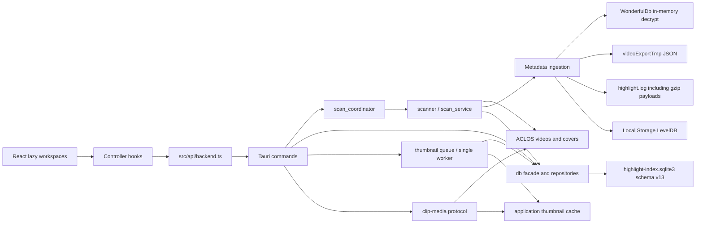

# Architecture

本文描述当前生产实现，不再混用早期 `assets`、`start_scan`、`DetailPanel` 等目标命名。数据表、command 和组件名称均以当前源码为准。

## 1. 系统总览

瓦刻（VALOFRAME）是 Tauri 2 桌面应用。React 负责素材库、扫描、标签和预览工作区；Rust 负责只读发现 ACLOS 文件、合并本地元数据、维护 SQLite 索引、后台缩略图队列和受限媒体协议。



核心边界：

- ACLOS 视频、封面和元数据目录在扫描、预览和常规整理中只读；只有回收站的显式永久删除命令会删除所选视频。
- 自动生成的 JPEG 只写应用缩略图缓存；生成状态和安全 basename 写入 SQLite，不复用或覆盖源 `cover_path`。
- 用户的收藏、标签、备注、回收状态和索引只写入应用 SQLite。
- WonderfulDb 账号文件只读，以 openid 派生密钥在内存中完成 AES-256-CBC 解密；不写出完整明文副本。
- 稳定账号身份来自 WonderfulDb/openid、match account ID 或来源账号 ID；玩家名仅用于展示和搜索。
- 单个来源或元数据文件失败应形成有界扫描错误摘要并继续处理其他来源。

## 2. Rust 后端

| 模块 | 当前职责 |
| --- | --- |
| `lib.rs` | 初始化单实例保护和 Tauri、注册 `clip-media`、迁移数据库、恢复中断扫描/删除意图、管理扫描与缩略图协调器并注册 commands |
| `commands.rs` | ping、扫描任务/磁盘发现、进度取消和缩略图 command 的聚合入口 |
| `commands/library.rs` | 素材分页/详情、来源、标签、收藏、回收、备注、媒体令牌及系统文件管理器 commands |
| `commands/media_protocol.rs` | 通过 clip ID 查询最新路径，处理源/生成封面、HEAD、Range 和最多 1 MiB 的媒体响应 |
| `thumbnail.rs` | 解析受控 FFmpeg、单 worker、超时/取消、指纹提交、事件和缓存维护 |
| `scan_coordinator.rs` | 保证同一时刻只有一个扫描任务，维护 job ID、进度、取消和终态 |
| `scanner.rs` | 文件索引、封面匹配、元数据摄取、missing 判定和扫描批次统计 |
| `scanner/scan_service.rs` | 默认、自定义、多根和发现结果的统一扫描编排 |
| `scanner/scan_runs.rs` | scan-run 生命周期、终态兜底、有界错误解析和批次摘要持久化 |
| `drive_discovery.rs` | Windows 固定磁盘枚举、受控目录遍历、候选来源验证和去重 |
| `db.rs` | 数据库路径、迁移/普通/只读连接、写入与元数据修复入口、公共 repository facade 和自然名称排序 |
| `db/migrations.rs` | schema v13 建表、版本迁移、索引、触发器、回收身份快照、删除意图、评分来源字段，以及旧自动标签到视频类型元数据的迁移 |
| `db/models.rs` | command 与 repository 共用 DTO |
| `db/repositories/library.rs` | legacy 列表、分页摘要、全库 facets、筛选排序、行映射和批量事件/标签装配 |
| `db/repositories/*` | clips、删除意图、sources、tags 与 thumbnails 的查询和事务写入 |
| `wonderful_db.rs` / `wonderful_ingest.rs` | 官方 match/video 解密归一化、clip 匹配和视频时间线写入 |
| `metadata.rs` | `videoExportTmp/config-*.json` 容错解析 |
| `highlight_log_parser.rs` | 明文及 gzip 日志 payload 解析，按 GameID 分局，并以账号、当前玩家身份、结算总分和连续回合共同确认单回合官方评分 |
| `leveldb_reader.rs` / `metadata_ingest.rs` | LevelDB 快照读取及对局级回退合并 |

数据库生命周期明确分离：

1. 应用启动时 `initialize_database` 创建目录并调用 `migrate_database`；拒绝未来 schema，迁移前后运行完整性检查，旧版本升级前创建经校验的在线备份。
2. schema 变更与版本号在一个 `IMMEDIATE` 事务中提交；失败时全部回滚。启动错误通过原生恢复提示暴露数据与备份目录，不静默覆盖数据库。
3. 数据库可用后先终结上次异常退出遗留的扫描，并恢复已持久化的永久删除意图，再启动缩略图 worker 和主窗口。
4. 普通写请求使用 `open_database`，不会执行 schema 初始化。
5. 列表、详情、来源、facets 和媒体路径查询使用短生命周期只读连接。
6. 媒体协议在关闭数据库连接后再读取文件，不把 SQLite 连接保持到流式响应结束。
7. 所有连接使用 `WAL + synchronous=FULL`；永久删除授权提交必须在触碰文件前具备断电耐久性。

## 3. React 前端

| 模块 | 当前职责 |
| --- | --- |
| `App.tsx` | 页面路由、筛选组合、全局刷新、通知和 controller 组合 |
| `screens/LibraryWorkspace.tsx` | 素材库、选择、批量操作和加载更多入口 |
| `screens/ScanWorkspace.tsx` | 来源队列、全电脑发现、进度、取消和扫描结果 |
| `screens/TagManagementWorkspace.tsx` | 标签统计、搜索、创建、修改和删除 |
| `screens/PreviewWorkspace.tsx` | 按需详情、媒体播放、时间轴、标签和备注 |
| `hooks/useClipPageController.ts` | 分页、generation 隔离、跨页去重和失败重试 |
| `hooks/useClipDetailController.ts` | 按需详情、请求令牌和最多 6 项 LRU 缓存 |
| `hooks/useClipMutationController.ts` | 单条及批量收藏、标签、回收和摘要 patch |
| `hooks/useLibraryFacetsController.ts` | 全库精确聚合，不从已加载页面推导筛选项 |
| `hooks/useScanController.ts` | 扫描事件监听、状态恢复、互斥错误和终态刷新 |
| `hooks/useTagController.ts` | 标签加载与 mutation |
| `hooks/useThumbnailController.ts` | 按已加载页面批量 ensure、单事件订阅、ready revision 去重和显式重试 |
| `components/MatchLibrary.tsx` | 顶层对局组与极端单组视觉行分层虚拟化、分页触底和键盘交互 |
| `components/ThumbnailImage.tsx` | 封面协议错误的局部回退和新 revision 重试 |

四个 workspace 使用 `React.lazy` 按页面拆包。生产入口不再引用旧 `ClipGrid`、`DetailPanel`、`SourceSidebar` 等组件。

## 4. Command 契约

生产前端使用的主要 commands：

| 类别 | Commands |
| --- | --- |
| 扫描 | `scan_default_aclos_dir`、`scan_roots`、`discover_and_scan_fixed_drives`、`get_scan_status`、`cancel_scan`、`get_scan_summary` |
| 素材读取 | `list_clip_page`、`get_library_facets`、`get_clip_detail`、`list_sources` |
| 标签 | `list_tags`、`create_tag`、`update_tag`、`delete_tag` |
| 素材写入 | `set_clip_favorite`、`set_clips_favorite`、`set_clip_trashed`、`set_clips_trashed`、`remove_clip_from_index`、`delete_clips_permanently`、`update_clip_note` |
| 标签绑定 | `add_tag_to_clip`、`add_tag_to_clips`、`remove_tag_from_clip`、`remove_tag_from_clips` |
| 缩略图 | `ensure_clip_thumbnails`、`retry_clip_thumbnails`、`get_thumbnail_status` |
| 文件与媒体 | `get_clip_media`、`open_clip_location`、`copy_clip_path` |

`list_clips`、`scan_custom_dir` 和 `ping_backend` 暂时保留兼容契约，但生产素材库不再依赖 `list_clips`。

`delete_clips_permanently` 只接受 `file_status = 'trashed'` 的记录。命令先持久提交不可变删除授权，再通过 Windows 文件身份与同一受控句柄校验并删除目标，最后原子移除 intent 与索引；来源离线或暂时占用时保留待重试 intent，身份替换或路径越界时取消旧授权并返回不可重试阻断，绝不把授权静默扩展到替换文件。

### 4.1 列表、facets 与详情

- `list_clip_page` 默认返回 50 条，允许范围为 1–200；所有筛选在后端执行。
- 普通浏览保持 50 条增量分页；用户明确执行“全选全部结果”时，前端用 200 条页面顺序补齐同一查询，再建立完整 ID 选择，加载失败时不提交半完成的全选状态。
- 搜索字段之间是 OR，不同筛选维度之间是 AND；SQL 使用参数绑定并转义 LIKE 元字符。
- count、当前页和页内标签在同一只读快照中读取；标签批量加载，不产生 N+1。
- 五种排序均追加 clip ID tie-breaker；文件名排序使用数字感知 collation。
- `ClipSummary` 包含卡片/分组所需的稳定账号、来源路径、战斗分、状态和轻量标签 ID，不包含备注、OCR、raw JSON 或事件。
- `get_clip_detail` 只加载一个完整 Clip、完整 Tag 对象和该 clip 自己的事件；不存在时返回稳定 `clip-not-found` 错误。
- `get_library_facets` 针对整个索引统计账号、来源、英雄、地图、模式、自定义标签、视频类型、状态和大小范围。

### 4.2 批量操作

批量收藏、标签和回收均由单个后端 command 在一个事务内执行。输入 ID 会去重，结果报告匹配和缺失数量；中途失败回滚整个批次。前端只在操作影响当前筛选条件时重置一次分页。

## 5. 运行时数据流

### 5.1 启动

1. 单实例插件先拦截重复启动；主进程执行一次 schema v13 迁移。
2. 后端把异常遗留的 running/cancelling 扫描收敛为 failed，并恢复持久化的永久删除意图。
3. 后端恢复中断的缩略图任务、清理受控缓存并启动一个 worker；找不到受控 FFmpeg 时把待处理队列一次性标为 unavailable。
4. React 加载第一页、全库 facets、来源 DTO 和标签，并按页面批量 ensure 缺失缩略图。
5. 页面默认进入素材库；不会因为数据库为空而隐式启动扫描。

### 5.2 多根扫描

1. 前端把当前来源和用户暂存目录合并、规范化并去重后，一次调用 `scan_roots(paths)`。
2. `scan_coordinator` 分配 job；已有任务时返回稳定 `already-running` 错误。
3. 扫描线程为整批根目录只采集一次共享元数据快照。
4. 每个真实 `wonderfulVideos*` 来源支持两种视频布局：来源根目录直接 MP4，或 `来源/对局/MP4`；扫描器不把任意深层目录都当素材。
5. 扫描按来源和文件推进，以事件上报进度，并在阶段/文件边界响应取消。
6. 终态为 `completed`、`partial`、`cancelled` 或 `failed`；已安全提交的短事务保留，下一次重扫可幂等修复。
7. completed、partial、cancelled 或 failed 终态会唤醒缩略图 reconcile；`already-running` 不刷新前端，也不重复唤醒队列。
8. 除 `already-running` 外，前端在终态刷新来源、标签、facets 和当前第一页。

全电脑发现只遍历 Windows 固定磁盘，跳过临时目录、回收站、系统卷和重解析点；候选来源通过 MP4 布局验证后再交给同一多根扫描服务。

### 5.3 元数据优先级

```text
WonderfulDb clip record
  > video export JSON
  > highlight.log match fields
  > LevelDB battle summary
  > filename/path inference
```

这个优先级按字段和所有权执行。`matches`/`match_stats`/`match_events` 保存整场信息；`clips`/`clip_metadata` 保存视频身份和分类；`clip_segments`/`clip_events` 保存视频自己的组装区间和相对事件。单个视频的 `kill_count` 只能由该 clip 的 `clip_events` 中当前玩家击杀计算，不能使用整场事件累计。视频类型固定为三杀时刻、四杀时刻、五杀时刻、六杀时刻、击杀集锦和死亡时刻；标签表只保存用户创建的标签，标签名称不参与视频类型判断。

### 5.4 媒体

前端只把 clip ID 交给 `clip-media` 协议。每次请求重新从只读数据库查询当前路径，拒绝非 MP4 视频；无 Range 的大文件也只返回首个最多 1 MiB 分段，避免把整个视频读入内存。

`cover/{clipId}?v={revision}` 仍只暴露 clip ID 和缓存版本。协议先返回源目录已有且由扫描器标记为 `file` 的封面；否则只接受 `clip_thumbnails` 中 ready 状态的安全 basename，并在规范化后的应用缓存根内解析。生成封面限制为完整 JPEG 和最多 4 MiB，支持 GET/HEAD，并返回 `nosniff`；物理缓存路径不会进入前端 DTO。

缩略图指纹包含输出版本、规范化视频路径、大小和修改时间。生成完成时，数据库在同一原子条件中再次核对当前 clip 行、指纹、可用状态和源封面状态，扫描期间完成的陈旧任务不能覆盖新状态。前端监听 `thumbnail-progress`，只在 ready revision 变化时局部 patch 已加载摘要、详情缓存和 poster，不刷新分页或重新请求媒体。

## 6. 状态与数据所有权

当前生产写入的主要文件状态：

| 状态 | 含义 |
| --- | --- |
| `available` | 文件存在且未进入应用回收站 |
| `missing` | 历史文件在一次可判定的扫描中未见 |
| `trashed` | 仅数据库中的回收状态，原视频不变 |

`inaccessible` 与 `unsupported` 仍属于查询/兼容契约，但当前扫描器不会把它们作为 clip 的常规持久化终态。

元数据状态包括 `not_found`、`parsed`、`partial`、`failed` 和 `enriched`。来源失败不会删除已有用户数据；对不可访问来源也不会把历史素材误标 missing。

永久删除不把 NTFS 操作伪装成 SQLite 原子事务。素材进入回收站时先写入不可变 `clip_trash_snapshots` 文件身份；用户二次确认后，后端只能从该快照派生并以 FULL 同步语义提交 `clip_delete_intents`，再校验并删除同一文件，最后原子移除 intent 与 clip。崩溃后按持久意图幂等恢复；旧回收记录无快照或目标身份变化时保留 clip 和文件、取消/拒绝旧授权并要求恢复后重新回收确认，不把未知状态当成成功。

缩略图状态由独立表维护，包括 `pending`、`running`、`ready`、`failed`、`unavailable`、`suppressed` 和 `evicted`。源封面或非 available 素材使用 `suppressed`；生成器缺失使用全局 `unavailable`，不会逐素材启动失败任务。

## 7. 安全边界

- 生产 CSP 默认只允许自身脚本和字体；图片仅允许自身、data 和自定义本地媒体协议，不连接第三方美术资源服务。
- `style-src 'unsafe-inline'` 是为 React/Motion 运行时 style 属性保留的显式例外；生产不允许 `unsafe-eval`。
- 开发 CSP 另行允许本机 Vite HMR websocket 和开发脚本能力，不复用到生产。
- 主窗口 capability 只开放事件 listen/unlisten 和目录选择；未使用的 `tauri-plugin-opener` 已删除。
- “打开原位置”通过受控 Rust command 以独立参数调用系统文件管理器，不接受任意 shell 字符串。
- FFmpeg 只从应用资源 `bin/ffmpeg(.exe)` 或绝对路径 `VHM_FFMPEG_PATH` 解析，不搜索 `PATH`，不经 shell 启动；进程有超时、取消和隐藏窗口控制。
- 缓存清理只处理严格命名的直接文件和陈旧 `.part`，拒绝路径穿越、目录和符号链接，不递归删除未知内容。
- 永久删除只处理回收站内、属于已验证来源且与持久化意图快照一致的 MP4；待删除记录会阻止普通恢复和仅删除索引。
- Tauri 单实例插件在数据库初始化前拦截第二个进程；重复启动只恢复、显示并聚焦现有主窗口，不接受外部路径或命令参数。
- 当前自定义 application commands 仍使用 Tauri 的默认应用命令可见性；若未来增加远程窗口或多权限窗口，应通过 `AppManifest::commands` 为这些 commands 建立显式 ACL。

## 8. 性能与一致性

- 素材列表采用服务端分页和顶层对局组虚拟化；单组超过 48 条时复用同一滚动容器按视觉行二级虚拟化，不产生嵌套滚动区。
- 组内网格列数来自真实内容宽度；宽度、视图、折叠和跨页素材数量变化会使对应测量缓存失效。多组及单组 1k/10k fixture 的卡片 DOM 均保持有界。
- 快速切换详情使用请求令牌隔离旧响应；备注 mutation 不触发媒体重新加载。
- 跨页分组使用稳定账号 + match key，保持后端顺序并避免重复标题。
- 数据库只在启动迁移；媒体和普通请求不执行建表、检查列或标签初始化。
- 列表与详情分离，避免在大素材库为全部 clips 加载事件。
- 缩略图队列持久化在 SQLite，内存 channel 只合并唤醒信号；一个 worker 有界执行，前端每批最多提交 200 个 ID。
- 缓存在生成期间持续检查 512 MiB 高水位，并按最旧 ready 项清理到 450 MiB；缺失、损坏、孤立和中断临时文件可幂等修复。
## 9. 验证与剩余工作

本地和 CI 使用同一组门禁：

```powershell
npm test
npm run build
cargo fmt --manifest-path src-tauri/Cargo.toml -- --check
cargo clippy --manifest-path src-tauri/Cargo.toml --locked --all-targets --all-features -- -D warnings
cargo test --manifest-path src-tauri/Cargo.toml --locked --all-targets --all-features
```

仍未完成的产品能力：

- 批量备注及更完整的失败恢复交互。
- 安装包内 FFmpeg 资源与许可证验证、发布回归、自动更新与恢复策略。
- 将 legacy `list_clips` 等兼容 command 完全退役。
- CSP 下的目录选择、事件、封面、视频和远程图片仍需发布前实机回归。
