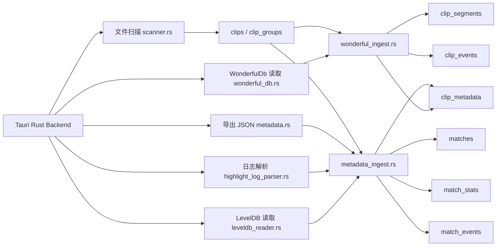

# 本地元数据采集方案

## 1. 目标

扫描器把 WonderfulDb、`videoExportTmp/config-*.json`、`highlight.log`、Local Storage LevelDB 和路径推断合并为本地索引。应用只读 ACLOS 的原始目录和元数据文件，不读取游戏进程、内存或反作弊数据，也不向 ACLOS 写回任何内容。

目标是让素材列表和详情页能稳定展示：

- 账号 ID / 玩家名
- 对局 ID / battle ID
- 英雄、地图、模式
- KDA、比分、胜负、战斗分
- 录制时间、对局时间、击杀事件时间
- 英雄头像 URL 等可展示资源

## 2. 数据源

| 数据源 | 本地位置 | 提供信息 | 持久性 | 当前处理 |
| --- | --- | --- | --- | --- |
| WonderfulDb | `%APPDATA%\ACLOS\WonderfulDb\<account_id>` | 官方 match/video 身份、标题、分类、分段、视频内事件 | 最高，官方 clip 记录 | 内存解密、逐账号容错 |
| Local Storage LevelDB | `%APPDATA%\ACLOS\Local Storage\leveldb` | `acloshighlight_battle_list_<account_id>`、battle ID、match ID、KDA、日期、英雄头像 URL | 较低，历史回退 | 只读容错解析 |
| `highlight.log` | `%APPDATA%\ACLOS\logs\highlight.log` | 玩家名、地图、模式、英雄、比分、战斗分、击杀事件时间 | 中等，会轮转 | 明文与 gzip payload 容错解析 |
| 文件系统扫描 | `%USERPROFILE%\AppData\ACLOS\aclos-highlight\wonderfulVideos*` | mp4 路径、封面、文件大小、修改时间、来源账号目录 | 高，只要文件存在 | 来源根与直接对局子目录索引 |
| 导出 JSON | `wonderfulVideos*\videoExportTmp\config-*.json` | 截图/导出模板中的 KDA、地图、模式、玩家名 | 高于日志/LevelDB，数据可能稀疏 | 文件索引阶段解析 |
| gzip 事件 payload | `highlight.log` 中 `event: "H4sI..."` | 原始压缩事件流 | 中等 | Base64 + gzip 解码并容错解析，作为对局级回退 |

## 3. 当前架构



当前 Rust 模块：

| 模块 | 职责 |
| --- | --- |
| `wonderful_db.rs` | 读取数字账号文件，在内存中完成 AES-256-CBC/PKCS#7 解密并容错归一化官方 match/video/segment/event 记录。 |
| `wonderful_ingest.rs` | 以官方路径或账号 + match + video 文件名匹配 clip，写入官方分类及 clip 自有时间线。 |
| `leveldb_reader.rs` | 只读读取 Chromium Local Storage LevelDB，提取 `acloshighlight_battle_list_*`。 |
| `highlight_log_parser.rs` | 解析 `highlight.log` 的明文记录，并对 `event: "H4sI..."` 做 Base64 + gzip 解码。 |
| `metadata_ingest.rs` | 合并 LevelDB 与日志，生成统一对局元数据，并按字段补齐导出 JSON 留空项或纠正 inferred/fallback 值。 |
| `metadata.rs` | 解析 `videoExportTmp/config-*.json`；命中字段的优先级高于日志和 LevelDB。 |

## 4. 关联规则

跨来源的总体优先级为：

```text
WonderfulDb clip record > video export JSON > highlight log match fields > LevelDB battle summary > filename/path inference
```

该顺序按字段和所有权应用：WonderfulDb 一旦命中某个视频，它提供的官方 video 身份、标题、分类、分段和视频内事件不得被较低优先级来源覆盖；导出 JSON 已提供的玩家、英雄、地图、模式、比分和 KDA 也不被日志/LevelDB 覆盖，只有其空字段才由较低来源补齐。旧的 inferred/fallback 行没有此保护，可由日志或 LevelDB 纠正。较低来源缺失或损坏时继续向后降级，不影响 mp4 索引。

执行顺序与最终优先级方向相反：扫描器先完成文件索引并写入命中的导出 JSON，再导入日志/LevelDB 回退，最后由 WonderfulDb 对命中的官方 clip 做权威覆盖。`metadata_source = 'video_export'` 记录导出字段保护；`metadata_source = 'wonderful_db'` 阻止后续普通扫描覆盖。若本轮没有选中导出 JSON，扫描器不会主动清空上一轮已保存的导出字段，以避免临时缺文件造成数据丢失。

### 账号展示名称优先级

WonderfulDb 事件中的最新有效 `PlayerName` 是账号展示名称的最高优先级来源。导入器按 `openid` 聚合事件名称，以 `match_time`、事件时间和稳定遍历次序选择最新候选，再通过账号名称传播边界补齐该账号的全部 clips 与 matches。

完整回退顺序为：WonderfulDb `PlayerName` > video export JSON > `highlight.log` > LevelDB > account ID > `wonderfulVideos...` 目录名。名称仅用于展示和搜索；账号身份仍由数字 `openid` 决定。无效名称或 `wonderfulVideosundefined` 不参与传播，且不会清空已有低优先级名称。

优先使用强 ID，最后才使用时间推断：

1. `match_id` 或 `battle_id` 精确匹配 `clip_groups.group_key`，也就是 `wonderfulVideos*/<uuid>` 目录名。
2. `account_id` 匹配 `wonderfulVideos<account_id>`，并且 `highlight.log` 的 `recordSrc` 指向同一来源。
3. `account_id` 相同，clip 文件修改时间落在对局开始和结束时间附近。
4. 仍无法关联时保留 clip，只显示文件扫描信息和导出 JSON 兜底字段。

字段优先级：

| 字段 | 优先来源 |
| --- | --- |
| 官方 video ID、标题、分类、分段、视频内击杀事件 | WonderfulDb clip record |
| `game_id`、`battle_id`、KDA、对局日期、英雄头像 | WonderfulDb/导出 JSON 未提供时优先使用有效完整日志，缺失项再由 LevelDB 补齐 |
| 玩家名 | WonderfulDb 最新有效 `PlayerName`，其次导出 JSON、`highlight.log`、LevelDB 和账号 ID |
| 地图 ID、模式、战斗分、对局级回退事件 | `highlight.log`，不覆盖 WonderfulDb 的 clip 时间线 |
| 单回合官方视频评分 | WonderfulDb `round_score` 优先；缺失时先按 GameID 分局，并用 GameSettle OpenID 绑定同账号 WonderfulDb，只使用经唯一 `GameSettle.TotalScore`、可用玩家身份与连续 `RoundEnd` 共同确认的本人 `MatchCombatScore` 回合累计差；日志缺失的尾局不推算 |
| 英雄名、比分、胜负 | `highlight.log` 的 `template param`，其次 `first request data`，再其次 LevelDB |
| 截图模板可见文字 | 导出 JSON 兜底 |

## 5. 当前数据库表

schema v13 使用 `source_dirs`、`clip_groups`、`clips`、`clip_metadata`、`clip_tags`、独立的 `clip_thumbnails`、回收身份快照 `clip_trash_snapshots` 和永久删除 outbox `clip_delete_intents` 等当前命名，不再使用早期文档里的 `assets` 命名。v10 将旧自动分类标签迁移为 `clip_metadata` 视频类型；v11 增加字段级 `round_score_source`，区分 WonderfulDb 原值与官方日志精确恢复值；v12 增加崩溃可恢复的永久删除意图；v13 把永久删除授权绑定到素材进入回收站时的不可变 Windows 文件身份，不改变元数据摄取优先级。

`matches`：

```sql
CREATE TABLE IF NOT EXISTS matches (
  id INTEGER PRIMARY KEY AUTOINCREMENT,
  game_id TEXT UNIQUE,
  battle_id TEXT,
  account_id TEXT,
  player_name TEXT,
  agent_name TEXT,
  agent_id TEXT,
  agent_avatar_url TEXT,
  map_id TEXT,
  map_name TEXT,
  game_mode TEXT,
  started_at TEXT,
  ended_at TEXT,
  source_leveldb INTEGER NOT NULL DEFAULT 0 CHECK (source_leveldb IN (0, 1)),
  source_log INTEGER NOT NULL DEFAULT 0 CHECK (source_log IN (0, 1)),
  created_at TEXT NOT NULL DEFAULT CURRENT_TIMESTAMP,
  updated_at TEXT NOT NULL DEFAULT CURRENT_TIMESTAMP
);
```

`match_stats`：

```sql
CREATE TABLE IF NOT EXISTS match_stats (
  match_id INTEGER PRIMARY KEY REFERENCES matches(id) ON DELETE CASCADE,
  kills INTEGER,
  deaths INTEGER,
  assists INTEGER,
  headshots INTEGER,
  combat_score INTEGER,
  rounds_won INTEGER,
  rounds_lost INTEGER,
  rounds_played INTEGER,
  has_won INTEGER CHECK (has_won IN (0, 1)),
  updated_at TEXT NOT NULL DEFAULT CURRENT_TIMESTAMP
);
```

`match_events`：

```sql
CREATE TABLE IF NOT EXISTS match_events (
  id INTEGER PRIMARY KEY AUTOINCREMENT,
  match_id INTEGER NOT NULL REFERENCES matches(id) ON DELETE CASCADE,
  event_type TEXT NOT NULL,
  event_time TEXT,
  round_id INTEGER,
  weapon_name TEXT,
  killer_name TEXT,
  killed_name TEXT,
  raw_json TEXT,
  created_at TEXT NOT NULL DEFAULT CURRENT_TIMESTAMP
);
```

WonderfulDb 视频时间线使用：

- `clips` 保存本地文件与官方 video 身份对应关系。
- `clip_metadata` 保存官方标题、分类、`kill_count` 与来源标记。
- `clip_segments` 保存该视频内的剪辑/组装区间。
- `clip_events` 保存相对该视频的事件时间与 `killer_is_me`。
- `match_events` 只保存整场对局级回退事件；它不能用来计算某个 clip 的官方击杀数。

`clip_metadata.kill_count` 必须只统计当前 `clip_id` 的 `clip_events` 中 `event_type = 'kill' AND killer_is_me = 1` 的事件。禁止把同一 match 的 `match_events` 或其他视频事件累加到当前 clip；这正是避免六杀视频被误计为整场 26 杀的边界。

扩展使用现有表：

- `clip_metadata.match_id` 存关联到的 `matches.game_id`。
- `clip_metadata.kill_count` 只由 WonderfulDb 的 clip-scoped 自身击杀事件计算；`match_events` 不再写回 clip 的击杀数、武器或回合标签。
- `clips.recorded_at` 在命中 WonderfulDb 时优先使用官方对局时间，否则保留扫描器已有的文件时间推断。
- `metadata_status = enriched` 表示 clip 已命中 WonderfulDb 官方记录，或已关联 LevelDB/日志中的结构化对局数据。

## 6. 采集流程

应用启动只负责单实例交接、数据库迁移、索引加载，以及异常中断扫描/永久删除意图的恢复，不会隐式触发新的素材扫描。用户启动默认、自定义或多根扫描后，后端统一进入以下流程：

1. `scan_roots` 规范化并去重全部来源，创建一个扫描 job 和一个 scan run；共享元数据只采集一次。
2. 扫描 `wonderfulVideos*` 或自定义根目录，写入 `source_dirs`、`clip_groups`、`clips`；对每个 clip 解析命中的 `videoExportTmp/config-*.json` 并 upsert `clip_metadata`。
3. 解析 `highlight.log`（包括可解码的 gzip payload）和 LevelDB，按 `match_id/battle_id`、账号 ID、时间范围合并对局记录。
4. upsert `matches`、`match_stats`、`match_events`，并只补齐导出 JSON 留空的 clip 字段；没有导出/Wonderful 来源的 inferred/fallback 字段可被纠正。
5. 枚举 WonderfulDb 数字账号文件；每个文件独立读取、内存解密和解析。
6. 用官方路径优先、账号 + match + video 文件名兜底的方式匹配本地 clip，权威写入 `clip_metadata`，再替换 `clip_segments` 和 `clip_events`。
7. 持续发布进度，检查取消信号，依次提交各阶段写入并返回统一统计、终态和非致命 warning。

整个扫描不是单个数据库事务。普通文件/对局写入按现有语句执行；每个 WonderfulDb clip 的官方元数据在一个短事务中提交，时间线替换随后在独立事务中提交。视频类型完全来自元数据，不创建、删除或重命名用户标签。因此进程若恰好在两次提交之间中断，可能短暂出现元数据与时间线版本不一致；下一次重扫会按相同权威来源覆盖并修复。

## 7. 错误处理

- WonderfulDb 密文按账号文件只读；AES 解密和完整文档解析在进程内存中完成，不会生成一个解密后的 WonderfulDb 文件。应用 SQLite 除归一化字段外，还会保存部分完整 snapshot/event 记录序列化后的 `raw_json`；这些数据未由应用额外加密，详见[本地数据与隐私](./PRIVACY.md)。
- 某个 WonderfulDb 账号文件无法读取、解密或解析时，记录只含账号文件标识和错误类别的 warning；其他账号继续导入。
- LevelDB 被锁定时，优先复制可读 `.ldb`、`.log`、`CURRENT`、`MANIFEST-*` 到应用临时目录后解析；复制失败则跳过 LevelDB 并记录警告。
- 单条 LevelDB 记录 JSON 损坏时，只丢弃该条或保留可读字段，不中断扫描。
- `highlight.log` 单行 JSON 损坏时跳过该行。
- `event: "H4sI..."` 会尝试 Base64 + gzip 解码并解析结构化事件；解码或 JSON 失败计入坏行/警告并继续。它只作为对局级回退，不能替代 WonderfulDb 的 clip-scoped 时间线。
- 任意元数据源失败都不能阻断 mp4 入库、收藏、标签和备注展示。

## 8. 测试要求

- LevelDB fixture：包含 UTF-16LE 的 `acloshighlight_battle_list_<id>`，断言解析 battle ID、match ID、KDA、日期、头像 URL。
- `highlight.log` fixture：覆盖 `first request data is [...]` 和 `template param == {...}`。
- 合并测试：LevelDB 提供 KDA/日期，日志补玩家名/地图/英雄/击杀事件。
- 扫描集成测试：`wonderfulVideos<account_id>/<match_id>/*.mp4` 能被精确关联到 match。
- WonderfulDb 集成测试：验证账号文件隔离、官方路径优先、clip-scoped type 4/6/10 击杀数，以及六杀视频不会回归到 26。
- 手动真实库回归只接收 workspace 中的生产索引副本；测试再复制为 working DB，绝不把 `VHM_REAL_SCAN_DB` 指向 live SQLite。
- 容错测试：LevelDB 缺失、日志坏行、导出 JSON 损坏都不影响 mp4 扫描。

## 9. 数据边界

- WonderfulDb 只按本机文件格式在内存中解密；不绕过权限、不写回密文文件，也不生成独立的解密数据库文件。用于索引和详情的部分原始记录会落入应用 SQLite 的 `raw_json` 字段，必须按本地敏感数据处理。
- 不读取游戏进程、内存或反作弊数据。
- 不上传、不云同步。
- 不写入 ACLOS 原始素材目录。
- gzip `event: "H4sI..."` 是可降级的日志回退，不作为官方 clip 时间线或素材入库的必需条件。
