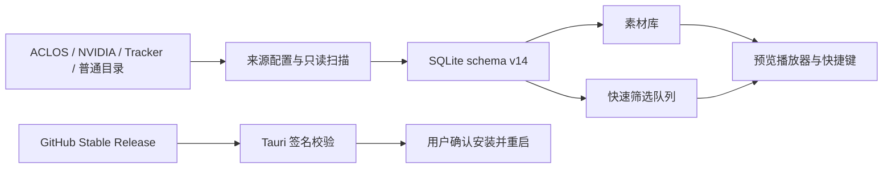

# 瓦刻（VALOFRAME）v0.2.0 版本计划书

> **历史方案：** 本文不再作为当前发布门禁。现行路线是用户手动安装 `v0.2.1`，再以 `v0.2.2` 完成首次应用内更新；发布要求以 [应用内更新](./APP_UPDATES.md) 和 [Windows 发布说明](./RELEASE.md) 为准。

> 后续版本说明：扫描新鲜度与新增数量、同源自动重连、来源根重新定位、仅移除索引以及击杀/死亡时间轴修订，已移至 [v0.2.1 版本计划书](./V0.2.1_PLAN.md)。本文继续保留 v0.2.0 的国际服来源、快捷键、快速筛选和更新工程历史基线，不追溯改写为 v0.2.1 范围。

> 文档状态：实施基线
>
> 编制日期：2026-08-08
>
> 目标平台：Windows 10/11 x64
>
> 目标版本：`v0.2.0`
>
> 当前基线：应用版本 `0.1.0`、SQLite schema v13、Tauri 2 + Rust + React 19 + TypeScript

## 1. 文档目的与版本定位

本文把 v0.2.0 已确定的产品方向转化为可实施、可测试、可发布的版本基线。后续开发以本文的范围、数据契约和验收标准为准；如果实现过程中需要改变数据边界、发布渠道或用户文件操作语义，应先更新本文并重新评审。

v0.2.0 的定位是“国际服素材接入与高效筛选版本”。核心价值不是在应用内录制游戏，而是把 NVIDIA 录屏、Tracker 录制输出等本地视频安全地纳入瓦刻，再通过播放器快捷键和卡片式快速筛选缩短整理时间。同时，本版本建立正式稳定版所需的应用内更新能力。

本版本计划以 GitHub 的非 prerelease 正式 Release 作为稳定更新源。不过，稳定版发布必须通过仓库现有严格公开发布门禁；功能开发完成不等于已经获得公开发布资格。若外部发布条件未满足，只能产出 `v0.2.0-rc.N` 候选，不得发布稳定 `v0.2.0`、不得更新 `latest.json`。

## 2. 产品目标

### 2.1 核心目标

1. 支持把国际服玩家通过 NVIDIA 或 Tracker 录制的本地 MP4 视频引入瓦刻，并按来源、相对目录和录制日期整理。
2. 为视频预览提供符合常见播放器习惯的键盘操作，减少鼠标操作。
3. 提供独立的卡片式快速筛选流程，让用户连续预览视频并以左滑、右滑完成取舍。
4. 提供应用内版本检查、下载、安装和重启更新流程；自 v0.2.0 起，后续版本无需用户重复访问下载页手动安装。

### 2.2 成功标准

- 用户能从来源向导添加 NVIDIA、Tracker 或普通录制目录，首次扫描和后续增量同步均不修改原视频。
- 已导入视频能明确显示来源、相对目录和有效录制日期，并继续使用现有素材库筛选、标签、收藏、备注和回收能力。
- 播放器快捷键在预览页稳定工作，且不会抢占输入框、对话框或其他可编辑控件的按键。
- 快速筛选可以连续处理大型队列；左滑不会进入回收站或删除文件，右滑会进入“喜欢”状态并收藏。
- 应用可以检查稳定版本更新，向用户展示版本和说明，并只在用户确认后下载、安装和重启。
- schema v13 升级到 v14 后，原有收藏、标签、备注、回收状态、删除意图和素材引用全部保留。

### 2.3 关键术语

- **引入**：只把本地视频路径及摘要写入应用索引，不复制、不移动、不重命名原视频。
- **同步**：重新读取已启用来源，新增或更新索引，并在来源可访问且扫描完整时识别缺失文件。
- **剔除/不喜欢**：写入独立的快速筛选决定；不等同于回收、永久删除或从素材库隐藏。
- **喜欢**：写入快速筛选决定，并同步设置现有收藏字段。
- **正式更新**：来自非 prerelease GitHub Release、通过 Tauri 更新签名验证并由用户确认安装的版本。

## 3. 范围与非目标

### 3.1 v0.2.0 范围

- ACLOS、NVIDIA、Tracker 和普通目录四种来源类型。
- 外部录制目录的只读递归 MP4 扫描、启动增量同步和手动同步。
- 素材来源、相对目录、录制日期的持久化与筛选展示。
- MP4 中 H.264、HEVC/H.265、AV1 的识别；环境不能直接播放时提供系统外部播放器回退。
- 播放器键盘快捷键及焦点保护。
- 独立快速筛选页面、筛选条件配置、卡片交互、撤销和完成统计。
- 独立的 `liked`、`disliked`、`unreviewed` 筛选决定。
- 启动时限频检查更新、手动检查、用户确认下载/安装、进度与错误反馈。
- GitHub 稳定 Release 更新元数据、Tauri 更新签名、Windows Authenticode 和正式发布门禁适配。

### 3.2 明确非目标

- 不在瓦刻中录制游戏画面，不注入或挂钩 VALORANT 进程。
- 不读取 Tracker 私有数据库、账号令牌或未公开内部接口；Tracker 在本版本中仅表示用户选择的录制输出目录来源。
- 不上传视频，不引入云同步、账号系统或遥测。
- 不支持 MKV、MOV 等新容器；本版本外部来源只索引 MP4。
- 不进行自动转码、代理文件生成或修改原视频编码。
- 不增加实时文件监听器；同步方式固定为启动增量扫描和用户手动同步。
- 不把左滑操作映射为回收站、永久删除或物理文件移动。
- 不静默安装更新，不建立 beta/stable 双更新通道，不自动降级。
- 不在本版本解析 NVIDIA 或 Tracker 特有的私有元数据数据库。

## 4. 功能规格

### 4.1 NVIDIA、Tracker 与普通视频来源

#### 4.1.1 来源向导

扫描页增加“添加视频来源”入口。向导提供以下来源卡片：

| 来源类型 | 扫描模式 | 用户选择内容 | 元数据策略 |
| --- | --- | --- | --- |
| ACLOS / 无畏时刻 | `aclos-structured` | ACLOS 根目录或现有默认目录 | 保留当前结构化扫描及已有四路元数据采集 |
| NVIDIA 录屏 | `recursive-mp4` | NVIDIA 录制输出目录 | 只读取 MP4 和文件系统摘要，不读取 NVIDIA 私有状态 |
| Tracker 录制 | `recursive-mp4` | Tracker 录制输出目录 | 只读取 MP4 和文件系统摘要，不读取 Tracker 私有数据库 |
| 其他录制目录 | `recursive-mp4` | 任意用户授权目录 | 只读取 MP4 和文件系统摘要 |

用户在确认前可以修改显示名称，并选择是否启用“应用启动时同步”。系统不得假设第三方工具始终使用某个固定默认路径；可以展示路径选择帮助，但最终以用户明确选择的目录为准。

添加来源前应规范化路径并检查重复或重叠来源。完全相同的规范化根目录应复用或提示已有来源；父子目录重叠时必须提示可能重复扫描，不能静默建立两个会竞争同一视频归属的来源。

#### 4.1.2 扫描与同步规则

- ACLOS 继续走现有结构化扫描器；外部来源走独立的递归 MP4 枚举器，两者复用现有扫描任务、全局互斥、进度、取消、终态持久化和错误汇总。
- 外部来源从用户选择的根目录向下递归，只接受扩展名大小写不敏感的 `.mp4` 普通文件。
- 不跟随符号链接、目录联接点或其他 Windows reparse point，避免越出授权根目录或形成循环。
- 每个候选文件在入库前验证规范化路径仍位于来源根内。任何路径逃逸、权限变化或类型变化都只记录受限错误，不继续访问目标。
- 对可能仍在录制的文件执行稳定性检查。若枚举前后大小或修改时间发生变化，或无法取得稳定摘要，本次跳过并在下次同步重试。
- 文件身份继续使用规范化绝对路径；同名文件不会合并，不同来源不得重复认领同一规范化路径。
- 首次扫描完成后持久化来源。应用启动时对所有启用自动同步的来源启动一个非阻塞、可取消的合并扫描批次；同一规范化扫描根只处理一次。
- 用户可以在扫描页执行“同步全部”或对单一来源执行“立即同步”。扫描运行时沿用全局互斥，不启动第二个竞争任务。
- 只有来源可访问、递归枚举完整且扫描未取消时，才允许把历史文件标记为 `missing`。来源离线、权限不足、枚举部分失败或用户取消时，保留历史素材状态并把来源标为 `unavailable` 或 `partial`。
- 删除或禁用来源只影响后续自动同步，不得自动删除索引或原视频；来源管理的破坏性行为继续遵守现有数据安全边界。

#### 4.1.3 整理与展示

外部视频不依赖 ACLOS 对局结构。应用使用以下只读逻辑组织方式，不在磁盘上新建或移动目录：

```text
来源类型 / 来源显示名
└── 相对目录（相对于用户选择的扫描根）
    └── 有效录制日期
        └── 视频
```

- `sourceRelativeDir` 保存视频父目录相对于扫描根的路径；根目录直放视频使用空字符串并显示为“根目录”。
- 有效录制时间按 `recordedAt → modifiedAt → firstIndexedAt` 回退。第三方来源不能可靠取得容器录制时间时，使用文件修改时间并在内部保留回退语义，不从不稳定的文件名格式强行推断。
- 素材库来源筛选显示来源类型和用户命名；卡片/详情可显示相对目录和有效日期。
- 外部来源没有英雄、地图、击杀数等结构化信息时保持为空，不伪造 ACLOS 元数据；用户仍可使用收藏、备注和自定义标签整理。

#### 4.1.4 编码与播放兼容

- 支持索引 MP4 容器中的 H.264、HEVC/H.265 和 AV1 视频，不因 WebView2 当前不能解码而拒绝入库。
- 预览继续优先使用受控 `clip-media` 协议和 WebView2 原生播放能力。
- 当前设备不能直接播放时，预览区显示明确的“当前系统无法内嵌播放”状态，并提供“使用系统默认播放器打开”。外部打开必须重新从数据库解析当前视频路径，限定为已索引、可用、根内的 MP4 文件。
- v0.2.0 不转码。升级最小 FFmpeg 构建时，只为缩略图补充实际所需的 HEVC/AV1 解码链，并同步更新固定构建配置、许可材料、对应源码、哈希和烟测。

### 4.2 播放器快捷键

播放器预览页增加以下快捷键：

| 快捷键 | 行为 |
| --- | --- |
| `Space` 或 `K` | 播放 / 暂停 |
| `←` / `→` | 后退 / 快进 5 秒 |
| `Shift + ←` / `Shift + →` | 后退 / 快进 10 秒 |
| `J` / `L` | 后退 / 快进 10 秒 |
| `M` | 静音 / 恢复上一音量 |

行为要求：

- 时间跳转必须裁剪到 `[0, duration]`，视频尚未加载 duration 时不报错。
- 只在预览播放器处于当前可交互页面时响应；不得在素材库全局无条件捕获按键。
- 当焦点位于 `input`、`textarea`、`select`、`button`、`contenteditable`、组合框、命令面板或模态对话框内时，不触发播放器快捷键。
- 对已处理的 `Space` 和方向键调用 `preventDefault`，避免页面滚动；未处理按键保持浏览器和辅助技术默认行为。
- 可见按钮的 tooltip/辅助文本标注快捷键，并通过适当的 `aria-keyshortcuts` 暴露。
- 卡片快速筛选页复用同一播放器快捷键内核；卡片决策键优先级高于普通播放器的未占用键。

### 4.3 卡片式快速筛选

#### 4.3.1 入口与队列配置

主导航增加独立“快速筛选”页面。每次开始会话前先进入配置页，支持：

- 选择一个或多个来源；默认全部可用来源。
- 选择日期范围；默认全部日期。
- 选择零个或多个自定义标签；同一维度内按“匹配任一所选标签”，不同维度之间按 AND 组合。
- 固定只处理 `available + unreviewed` 素材，默认按有效录制时间从新到旧排列。
- 显示预计待处理数量，并允许返回修改条件。

开始后冻结本次会话的筛选条件和候选上界。会话期间新扫描入库的视频不插入当前队列，避免总数和顺序跳变；它们在下一次会话出现。

#### 4.3.2 卡片布局与交互

- 卡片上方为视频预览，进入当前卡片后自动静音播放；浏览器或系统拒绝自动播放时显示可点击播放状态，不阻断决策。
- 卡片主体展示文件名、来源、相对目录、有效日期、时长、标签及已有的结构化摘要。
- 左滑、点击“不喜欢”或按 `A`：写入 `disliked`。
- 右滑、点击“喜欢”或按 `D`：写入 `liked`，并把现有 `is_favorite` 设置为 true。
- `Ctrl + Z` 或“撤销”：恢复本会话上一条操作前的筛选决定和收藏状态。
- 动画完成前禁用重复提交；后端成功后才正式移出当前卡片。写入失败时卡片回弹并显示可重试错误。
- 当前卡片之后至少预取下一条摘要和媒体 poster；不得一次加载整个视频队列或同时自动播放多条视频。

#### 4.3.3 筛选决定语义

| 决定 | 数据状态 | 素材库行为 |
| --- | --- | --- |
| `unreviewed` | 尚未在快速筛选中处理 | 默认进入快速筛选候选 |
| `liked` | 用户右滑喜欢 | 保留在普通素材库，并同步收藏 |
| `disliked` | 用户左滑剔除 | 保留在普通素材库，不进入回收站，不删除文件 |

普通素材库增加“筛选决定”筛选项，用户可以查看全部、未筛选、喜欢或不喜欢，并可以把决定重置为未筛选。手动修改收藏不会自动重写筛选决定；两者是独立状态，只有右滑操作明确同时写入两者。

队列分页使用稳定快照 + keyset cursor，不使用“写入后再按 offset 取下一页”的方式。否则当前条目从 `unreviewed` 集合移除后会造成后续条目跳过。排序键至少包含有效录制时间和 clip ID；cursor 对前端保持不透明。

#### 4.3.4 会话完成

队列耗尽后显示：

- 本次浏览数量、喜欢数量、不喜欢数量和撤销后净结果。
- “查看喜欢”“查看不喜欢”“按相同条件再检查”和“返回素材库”入口。
- 本次会话不创建新的物理目录，不自动导出或删除视频。

### 4.4 应用内版本检查与更新

#### 4.4.1 用户体验

- 设置/关于页显示当前版本，并提供“检查更新”按钮。
- 应用启动后进行非阻塞检查；同一设备自动检查最多每天一次。手动检查不受限频影响。
- 自动检查失败不弹阻断对话框、不影响离线使用；手动检查失败展示可理解的网络或服务错误。
- 检测到更高稳定版本后展示版本号、发布说明摘要和操作按钮。用户明确确认后才下载和安装。
- 下载阶段显示进度和可取消状态；下载或签名校验失败时保留当前版本可继续使用。
- 安装前提示应用将关闭并重启。扫描任务、永久删除处理或其他关键写操作正在运行时禁止安装，允许用户等待任务结束后重试。
- 不提供忽略签名、安装旧版本或切换到 prerelease 通道的入口。

#### 4.4.2 更新源与信任链

- 使用 Tauri 2 updater 插件及最小 capability，稳定端点为：

  `https://github.com/2424521842/valoframe/releases/latest/download/latest.json`
- GitHub `v0.2.0` 及后续稳定标签必须是非 draft、非 prerelease Release；Community Beta 工作流继续禁止生成 updater 资产。
- Tauri 更新签名为强制验证。公钥随应用发布，私钥离线备份并通过受保护的 GitHub Environment secret 注入发布任务，绝不写入仓库或构建日志。
- Windows 安装器和内嵌主程序同时需要 Authenticode 签名及可信时间戳。Authenticode 与 Tauri updater 签名是两条独立信任链，任一缺失都不能视为正式更新就绪。
- `latest.json`、更新包和 `.sig` 由同一个受保护的稳定发布工作流生成、校验并原子上传；发布失败不得留下指向未完整资产的 latest 状态。

#### 4.4.3 首次启用限制

当前 v0.1.0 不包含 updater，因此它无法自行发现或安装 v0.2.0。现有用户仍需手动安装一次 v0.2.0；自该版本起，后续满足签名和兼容策略的版本才能在应用内更新。发布说明和应用内提示必须明确这一过渡限制。

## 5. 技术方案

### 5.1 总体数据流



### 5.2 来源扫描架构

扫描实现拆分为共享协调层与来源适配层：

- **共享协调层**：复用现有 scan job、全局互斥、批次进度、取消令牌、终态持久化和 UI 事件。
- **ACLOS adapter**：保持当前 `wonderfulVideos*`、导出 JSON、日志、LevelDB、WonderfulDb 的现有行为。
- **recursive MP4 adapter**：服务 NVIDIA、Tracker、generic，只读取目录项和 MP4 文件摘要，不进入第三方私有数据目录做格式解析。
- **持久来源调度器**：按 `enabled + scanRootPath + scanMode` 汇总启动同步根；规范化去重后一次提交给扫描协调器。

递归枚举应采用流式/分批处理，不能先把 10k 文件的完整媒体对象全部物化到内存。目录错误使用有限错误集合和省略计数进入现有扫描摘要。每批数据库写入继续使用可恢复的短事务，取消后不得把未完整枚举来源的历史素材标为 missing。

### 5.3 前端状态与页面

- `AppScreen` 增加 `review` 和 `settings/about` 路由或等价的懒加载 workspace。
- 来源向导和同步状态复用扫描控制器，不在组件内直接拼接 Tauri command。
- 播放快捷键封装为可复用 hook，只依赖当前 video ref、激活状态和焦点保护函数。
- 快速筛选使用独立 controller，管理冻结查询、当前卡片、预取缓冲、提交中状态、会话统计和撤销栈，不复用素材库 offset 分页状态。
- 更新能力通过单一 updater service 包装 Tauri 插件，使自动检查、手动检查、下载进度和错误映射共享一套状态机。
- 快速筛选最近使用的条件、自动检查时间和非敏感 UI 偏好可保存在 WebView local storage；这些数据丢失不得影响素材索引或更新安全。

### 5.4 建议新增/调整的类型契约

```ts
type SourceKind = "aclos" | "nvidia" | "tracker" | "generic";
type ScanMode = "aclos-structured" | "recursive-mp4";
type ReviewDecision = "unreviewed" | "liked" | "disliked";

type ReviewQueueQuery = {
  sourceDirIds?: number[];
  tagIds?: number[];
  recordedFrom?: number;
  recordedTo?: number;
  snapshotMaxClipId?: number;
  cursor?: string;
  limit?: number;
};
```

`Source`、`BackendClip`、`ClipSummary` 和详情 DTO 增加来源类型、相对目录和筛选决定字段。素材库 `ClipListQuery` 增加 `reviewDecision`，现有 `FavoriteFilter` 保持兼容。

建议后端 command 边界：

| Command / service | 职责 |
| --- | --- |
| `register_scan_source` | 校验并持久化来源类型、扫描模式、根路径和显示名 |
| `sync_scan_source` | 同步单一来源，进入现有 scan job 协调器 |
| `sync_enabled_sources` | 规范化去重并同步全部启用来源 |
| `list_review_clip_page` | 使用冻结候选上界和 cursor 返回快速筛选页 |
| `set_clip_review_decision` | 在事务中写决定、时间及可选收藏变更，返回前后状态 |
| `reset_clip_review_decision` | 重置为 `unreviewed`，不触碰文件状态 |
| updater service | 检查、下载、验证、安装、进度映射和重启 |

已有 `scan_default_aclos_dir`、`scan_custom_dir`、`scan_roots` 可以保留兼容，但生产 UI 最终应走持久来源语义，避免注册来源和一次性扫描形成两套行为。

### 5.5 快速筛选一致性

- 开始会话时记录 `snapshotMaxClipId` 和规范化筛选条件。
- 后端只返回 `id <= snapshotMaxClipId`、`file_status = available`、`review_decision = unreviewed` 的候选。
- 排序使用 `COALESCE(recorded_at, modified_at, first_indexed_at) DESC, id DESC`，cursor 包含上一条排序键和 ID。
- 决策命令在一个事务中写入 `review_decision`、`reviewed_at`，右滑同时写 `is_favorite = 1`。
- 命令返回写入前后状态；前端撤销栈保存写入前状态，并通过同一事务接口恢复。撤销只保证当前运行会话，应用重启后不保留撤销栈。
- 任何写入失败都不推进 cursor 或统计；重复请求应按最终目标状态幂等。

### 5.6 更新实现

需要引入并固定版本的 Tauri updater 及重启所需插件，配置最小 capability、HTTPS endpoint 和 updater 公钥。启动检查在主窗口就绪后异步执行，不得阻塞数据库初始化、迁移或首屏。

稳定发布工作流需要：

1. 验证 `package.json`、`src-tauri/Cargo.toml`、`src-tauri/tauri.conf.json` 均为 `0.2.0`。
2. 从获批的完整 40 位 commit 构建 Windows x64 NSIS。
3. 生成和验证第三方合规材料及包含 HEVC/AV1 解码链的固定最小 FFmpeg。
4. 对主程序及安装器执行 Authenticode 签名、可信时间戳和 `signtool verify /pa /all /v`。
5. 使用 Tauri 私钥签署 updater 资产并验证错误密钥/篡改资产会失败。
6. 运行 bundle gate、启动 smoke、干净 VM、升级、数据安全和 updater 测试。
7. 生成 `latest.json`、安装器、`.sig`、SHA-256 和发布说明，并在同一受保护任务中创建非 prerelease GitHub Release。

Community Beta workflow 保持 updater-free，不能通过修改其现有“无 `latest.json` / `.sig`”断言来充当稳定发布流程。

## 6. 数据库变更

### 6.1 schema 版本

SQLite schema 从 v13 升级为 v14。迁移继续使用现有生命周期：迁移前健康检查、SQLite Online Backup、单个 `BEGIN IMMEDIATE` 事务、迁移后健康检查、失败回滚和未来版本拒绝。

### 6.2 `source_dirs` 新字段

| 字段 | 类型/约束 | 说明 |
| --- | --- | --- |
| `source_kind` | TEXT NOT NULL | `aclos`、`nvidia`、`tracker`、`generic` |
| `scan_mode` | TEXT NOT NULL | `aclos-structured` 或 `recursive-mp4` |
| `scan_root_path` | TEXT NOT NULL | 用户授权且用于重新同步的持久根路径 |

现有 `path` 继续表示逻辑来源/素材归属目录；`scan_root_path` 表示最初交给扫描器的根。对外部来源两者通常相同；ACLOS 一个扫描根可能发现多个 `wonderfulVideos*` 逻辑来源，因此两者不能简单合并。

现有 `enabled` 继续表示是否参与启动同步，`status`、`last_error` 和 `last_scanned_at` 继续记录来源可用性。增加适合 `enabled + scan_mode + scan_root_path` 调度查询的索引；规范化去重由应用层和数据库查询共同保证。

### 6.3 `clips` 新字段

| 字段 | 类型/约束 | 说明 |
| --- | --- | --- |
| `source_relative_dir` | TEXT NOT NULL DEFAULT `''` | 视频父目录相对 `scan_root_path` 的规范化展示路径 |
| `review_decision` | TEXT NOT NULL DEFAULT `unreviewed` | `unreviewed`、`liked`、`disliked` |
| `reviewed_at` | TEXT NULL | 最近一次写入 liked/disliked 的时间；重置时清空 |

建议索引：

- `review_decision + file_status + source_dir_id + recorded_at/modified_at + id`，服务快速筛选 keyset 查询。
- `source_dir_id + source_relative_dir`，服务来源目录展示和筛选。

### 6.4 v13 → v14 数据迁移

1. 所有现有来源回填为 `source_kind = aclos`、`scan_mode = aclos-structured`，`scan_root_path` 以现有安全路径语义回填；后续重新注册来源时可校正到更高层扫描根。
2. `source_relative_dir` 优先根据文件父目录相对来源路径计算；无法可靠计算时使用现有 `clip_groups.group_key`，仍无法计算则保留空字符串。
3. 已收藏的现有素材迁移为 `review_decision = liked`，`reviewed_at` 使用现有 `updated_at` 作为可解释回填；未收藏素材保持 `unreviewed`。
4. 不修改 `file_status`、`is_favorite`、`note`、标签、缩略图队列、回收快照或删除意图。
5. 迁移重复执行应幂等；普通 `open_database` 和只读连接不得触发迁移。

### 6.5 数据安全不变量

- 扫描、快速筛选和更新检查均不得写入、移动、重命名或删除来源视频。
- `disliked` 不是文件状态，不参与现有永久删除授权。
- schema v14 不放宽回收快照、删除 intent、句柄校验和来源目录边界。
- 更新安装前完成的应用退出不得留下 `running/cancelling` 扫描状态或处理中删除 intent；已有启动恢复逻辑继续负责异常收敛。

## 7. 实施里程碑

### M0：计划与契约冻结

交付：本文、最终产品决策、schema v14 字段、接口边界和发布门禁清单。

退出条件：范围、非目标、左/右滑语义、启动同步、格式策略和稳定更新渠道无未决产品问题。

### M1：schema v14 与来源模型

交付：数据库迁移、Rust/TypeScript DTO、来源类型和扫描模式、兼容旧库测试、文档同步。

退出条件：新库初始化和 v13 升级通过；用户状态完整保留；现有 ACLOS 扫描回归通过。

### M2：外部来源导入与同步

交付：来源向导、递归 MP4 adapter、来源持久化、启动增量同步、手动同步、相对目录/日期展示、外部播放器回退、HEVC/AV1 缩略图链。

退出条件：NVIDIA、Tracker、generic 测试目录完成首次扫描和增量同步；路径、reparse point、不稳定文件、离线来源及 10k 文件性能门禁通过。

### M3：播放器快捷键

交付：共享快捷键 hook、预览页接入、焦点保护、辅助文本和 UI 测试。

退出条件：全部快捷键及边界行为通过自动化测试和 Windows 实机回归。

### M4：卡片式快速筛选

交付：配置页、cursor 队列 API、卡片页、自动静音预览、左右滑/按钮/键盘、撤销、完成统计和素材库决定筛选。

退出条件：连续操作不会跳项或重复；liked/disliked 语义、事务失败回弹、撤销和大队列资源上限通过。

### M5：应用内更新工程

交付：关于页、自动/手动检查、下载进度、确认安装、签名验证、重启、稳定 Release workflow 和 updater 测试。

退出条件：正确签名升级成功；篡改、错误签名、离线、无更新、取消和关键任务占用均安全处理。

### M6：正式发布收敛

交付：版本号更新、完整 CI、合规/签名/VM/数据安全证据、发布说明、稳定 `v0.2.0` 资产。

退出条件：`release/public-release-policy.json` 全部真实获批，严格 public preflight 和 bundle gate 均通过，GitHub Release 为非 prerelease 且 updater 元数据可验证。任何一项未满足时仅发布 RC。

实施依赖关系：M1 是 M2/M4 的数据基础；M2 先于 M4 完成；M3 可在 M2 后半段独立实施；M5 可并行准备密钥/证书和 workflow，但稳定发布必须等待 M6。

## 8. 测试与验收标准

### 8.1 自动化基线

每个实施里程碑至少执行与改动相关的测试，候选版本执行完整门禁：

```powershell
npm ci
npm test
npm run build
cargo fmt --manifest-path src-tauri/Cargo.toml -- --check
cargo clippy --manifest-path src-tauri/Cargo.toml --locked --all-targets --all-features -- -D warnings
cargo test --manifest-path src-tauri/Cargo.toml --locked --all-targets --all-features
git diff --check
```

### 8.2 数据库验收

- 全新数据库直接建立 schema v14。
- v13 数据库升级前生成可读取备份，升级后 `quick_check` 和 `foreign_key_check` 通过。
- 现有收藏迁移为 liked；备注、标签、回收状态、回收快照和删除 intent 保留。
- 迁移中途失败时 schema 与 `user_version` 整体回滚。
- v14 重复初始化幂等；未来 schema 继续安全拒绝。
- 普通读写连接不迁移，不重新播种或覆盖用户状态。

### 8.3 来源导入验收

- 四种来源类型均能注册、列出、禁用/启用和手动同步。
- NVIDIA/Tracker/generic 能发现根目录和多层子目录中的大小写变体 `.mp4`；其他扩展名忽略。
- 规范化重复路径不重复入库；重叠来源有明确提示。
- 目录 junction、symlink、reparse point、路径逃逸和权限变化被跳过并记录，不越过授权根。
- 扫描期间变化的文件推迟到下一次同步，不保存不稳定摘要。
- 完整同步能标记真正缺失文件；离线、partial、cancelled 不误标历史视频 missing。
- 启动同步不阻塞首屏，同一根不重复扫描，已有全局扫描任务时不并发启动第二个任务。
- 10k 文件测试中内存和 DOM 数量保持有界，进度/取消持续响应，不全量读取视频内容。
- 扫描前后对来源目录做哈希/目录清单对比，确认没有写入、移动、改名或删除。
- H.264、HEVC、AV1 样本均能索引并生成受控缩略图；系统不能内嵌播放的样本能安全调用默认播放器。

### 8.4 快捷键验收

- `Space/K`、方向键、`Shift + 方向键`、`J/L`、`M` 的动作和秒数准确。
- 0 秒和视频末尾跳转不会越界或抛错。
- 未加载、加载失败、切换视频和快速连续按键状态稳定。
- 输入框、备注编辑、标签选择、命令面板和模态对话框不会触发播放器操作。
- 已处理按键不滚动页面；未处理按键不被吞掉。
- 按钮 tooltip 与辅助属性包含对应快捷键。

### 8.5 快速筛选验收

- 配置页的来源、日期和多标签组合返回正确候选数量。
- 当前会话只包含冻结上界内的 available + unreviewed 视频；会话中新增素材不插队。
- 左滑/A/按钮结果一致且仅写 disliked；右滑/D/按钮结果一致且写 liked + favorite。
- 决策不会修改 `file_status`、原文件、备注或标签。
- `Ctrl + Z` 恢复上一条决定和收藏状态，统计随之回滚。
- 后端写入失败时不推进卡片、cursor 或统计；重复提交不产生重复副作用。
- 跨分页处理不会跳项、重复或因决定写入改变 offset。
- 自动播放默认静音；自动播放被拒绝时仍可手动播放和完成决策。
- 长会话仅保留当前视频和有限预取资源，离开页面后释放 video src、事件监听和对象引用。

### 8.6 更新验收

- 无更新时正确显示当前为最新版；自动检查最多每日一次，手动检查始终可用。
- 离线、DNS/HTTPS 失败、GitHub 限流或元数据损坏不影响应用本地功能。
- prerelease、同版本、低版本和不兼容平台资产不会被当作可安装更新。
- 正确签名的高版本可以下载、显示进度、安装并重启，数据库和来源配置保留。
- 修改一个字节、错误 Tauri 签名、缺失 `.sig` 或元数据哈希不一致均拒绝安装。
- Authenticode 主体、证书 thumbprint、时间戳和 `signtool` 验证与发布 policy 一致。
- 扫描或永久删除处理期间禁止安装；任务完成后可以重试。
- 覆盖干净安装、v0.1.0 手动升级到 v0.2.0，以及从一个已含 updater 的签名版本升级到更高签名版本。
- 更新失败或用户取消后旧版本仍可启动；不允许借 updater 降级。

### 8.7 正式版本人工验收

- Windows 10/11 x64 干净 VM，100%/150%/200% 缩放和 760×560 最小窗口。
- WebView2 已安装、缺失且联网、缺失且离线的既有安装矩阵。
- NVIDIA 和 Tracker 实际输出样本的首次导入、重扫、重启同步、预览和快速筛选。
- 安装、覆盖升级、同版本重装、拒绝降级、卸载后用户数据保留。
- 安装器、主程序、FFmpeg、updater 包、`latest.json` 和 `.sig` 的文件清单及 SHA-256 留档。

## 9. 发布风险与应对

| 风险 | 影响 | 应对与发布门槛 |
| --- | --- | --- |
| v0.1.0 没有 updater | 老用户无法应用内升级到 v0.2.0 | 发布说明明确要求手动安装一次；只承诺 v0.2.0 之后的应用内更新 |
| 第三方录制目录结构可变化 | 自动猜测路径或分组可能失败 | 用户显式选择根目录；组织只依赖相对路径和文件时间，不读取私有数据库 |
| HEVC/AV1 的系统解码能力不一致 | 某些设备无法内嵌播放 | 索引与播放能力解耦；提供安全外部播放器回退，不在 v0.2.0 转码 |
| 扩大 FFmpeg 解码器集合 | 包体、攻击面、许可/专利复核增加 | 保持最小固定构建，补样本 smoke、SBOM、对应源码和人工合规审批 |
| 深层目录或 junction 循环 | 扫描越界、卡死或重复 | 禁止跟随 reparse point，逐项根边界检查，加入深度/文件量与取消压力测试 |
| 正在录制的文件被过早索引 | 缩略图或播放失败、摘要陈旧 | 大小/mtime 稳定性检查，本轮跳过并在下次同步重试 |
| offset 队列在写入后跳项 | 快速筛选漏掉视频 | 使用冻结候选上界和 keyset cursor，写入失败不推进 |
| 左滑语义被误解为删除 | 用户担心或误操作 | UI 明示“不喜欢，不会删除”；数据上与 trash/delete 完全分离 |
| 更新元数据或包被篡改 | 供应链风险 | HTTPS + Tauri 强制签名 + Authenticode + 哈希及受保护发布环境 |
| 签名私钥泄露 | 攻击者可伪造更新 | 私钥离线备份、环境隔离、最小权限、轮换和吊销预案；绝不写仓库/日志 |
| 自动安装撞上扫描/删除 | 数据库状态或文件操作中断 | 检查关键任务状态，禁止安装并要求任务收敛后重试 |
| GitHub 服务不可用 | 检查或下载失败 | 更新是非阻塞可选网络能力，失败后继续使用当前版本并允许稍后重试 |
| 稳定发布外部审批未完成 | 功能完成但不能合法/可信公开发布 | 严格 policy fail closed；只发 RC，不生成稳定 latest 元数据 |

## 10. 正式发布阻断项

截至本文编制时，`release/public-release-policy.json` 仍明确存在以下外部或人工阻断，不能由代码实现自行假定完成：

- 第三方依赖材料的最终人工合规批准。
- 产品品牌、合法 publisher 和稳定 identifier 的批准。
- 游戏内容公开安装器/下载分发范围及图标权利批准。
- Riot/腾讯非官方声明材料和审批记录。
- 包含实际 HEVC/AV1 解码能力的 FFmpeg 构建、许可、对应源码和目标市场复核。
- Authenticode 证书、预期 publisher subject、证书 thumbprint 和可信时间戳服务。
- Tauri updater 私钥托管、公钥、稳定 endpoint 和发布权限决定。
- 干净 VM 验收 evidence manifest 与精确 release commit 绑定。
- 来源只读、永久删除确认、应用数据边界和卸载行为的数据安全证据。

只有这些条目和全部工程门禁同时通过，才能把 `v0.2.0` 标记为正式稳定 Release。RC 通过、Community Beta 通过、安装器可运行或 updater 技术测试成功，都不能替代上述批准。

## 11. 完成定义

v0.2.0 被视为“功能完成”需满足：

- M1–M5 的交付物与自动化/人工验收全部通过。
- 文档同步到架构、数据模型、发布说明、Windows 检查清单和用户帮助。
- 无未关闭的数据丢失、越权文件访问、删除安全、更新签名或主要流程 P0/P1 缺陷。

v0.2.0 被视为“正式发布完成”还需满足：

- M6 全部完成，严格公开发布 policy、preflight、bundle gate、签名和 VM 证据均通过。
- GitHub `v0.2.0` 是非 draft、非 prerelease，资产和 SHA-256 与批准 commit 一致。
- `latest.json` 只指向本次已经完成上传和验证的签名资产。
- 发布说明明确 v0.1.0 用户需手动安装一次，以及此后应用内更新的使用方式和失败恢复方法。
