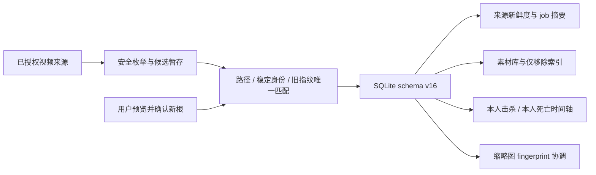

# 瓦刻（VALOFRAME）v0.2.1 版本计划书

> **历史方案：** 本文保留功能与迁移设计记录，不再作为当前严格发布审批依据。`v0.2.1` 现作为用户手动安装的 updater 起始版本，第一次 OTA 验收版本为 `v0.2.2`。

> 文档状态：实施基线（仓内实现与自动化已收敛；Windows 实机与稳定发布门禁待关闭）
>
> 编制日期：2026-08-09
>
> 目标平台：Windows 10/11 x64
>
> 目标版本：`v0.2.1`
>
> 版本基线：`v0.2.0`、SQLite schema v14、Tauri 2 + Rust + React 19 + TypeScript
>
> 目标 schema：v16（v15 事件/稳定身份迁移之上增加 Windows 路径别名去重）

## 1. 文档目的与版本定位

本文把扫描新鲜度、扫描终态反馈、来源目录恢复、失联素材索引清理，以及击杀/死亡时间轴修订独立为 v0.2.1 的必须完成范围。v0.2.0 继续按 [v0.2.0 版本计划](./V0.2.0_PLAN.md)交付国际服来源接入、播放器快捷键、快速筛选和应用内更新；本批可靠性与正确性需求不回灌到 v0.2.0，不改变其 schema v14 和发布资产边界。

v0.2.1 的定位是“扫描可信度与素材恢复版本”。它解决五类用户已经能感知但当前无法安全闭环的问题：不知道来源多久没有完整扫描、任务结束后不知道实际新增数量、目录改名或移动后索引失联、彻底失联后无法从普通素材库清理索引，以及击杀/死亡集锦的时间轴标记语义错误。所有实现继续以“默认只读来源文件、歧义时不合并、永久删除必须经回收站授权”为最高优先级。

开发可以在 v0.2.0 功能分支完成后开始，但 v0.2.1 的稳定发布必须基于已经包含 updater 的 v0.2.0 版本链。若稳定发布外部门禁仍未关闭，只能产出 `v0.2.1-rc.N`，不得让稳定更新清单指向未获批准的资产。

## 2. 产品目标、成功标准与术语

### 2.1 核心目标

1. 扫描页常显每个来源距上次完整扫描的本地自然日数；任一启用来源从未完整扫描或达到 7 天未扫描时，在扫描页和现有全局活动通知中重点提醒。
2. 每个扫描任务进入终态后按 job ID 只通知一次，并明确显示该任务安全写入的新增视频数；真实新增为 0 时也必须显示 0，无法取得任务摘要时必须显示“新增数量不可用”。
3. 同一授权来源内部的子目录改名可在后续扫描中按稳定文件身份自动重连；来源根目录改名或移动后，用户可预览并手动重新定位，同时保留 clip ID 和全部用户整理状态。
4. 普通素材库允许对 missing 或来源不可用的素材执行单条或批量“仅移除索引”，且绝不扩大回收站和永久删除的授权边界。
5. 击杀类高光只显示本人击杀，死亡集锦只显示本人死亡；两者使用不同图标，并修正普通高光与击杀/死亡集锦不同的事件时间语义。

### 2.2 成功标准

- 每个来源稳定显示“今天扫描”“N 天未扫描”或“尚未完成首次扫描”；停用来源不进入全局过期统计。
- `lastScanAt` 只代表完整成功扫描。partial、cancelled、failed 或仅完成目录重新定位均不能刷新该时间。
- 今天、6 天、7 天、跨本地午夜、夏令时、非法时间和未来时间均有确定、可测试的显示结果；全局提醒给出过期来源数量和最长未扫描天数。
- completed、partial、cancelled、failed 的终态反馈不会重复；有摘要时显示该 job 的真实 `newClipCount`，无摘要时不把缺失数据猜成 0。
- 同源唯一重命名可原地更新既有记录；复制文件、硬链接歧义、重复身份或重复旧指纹不会错误合并。
- 根目录重新定位前可查看匹配与冲突；提交后 clip ID、收藏、标签、备注、评审决定、结构化元数据和筛选状态保持不变，播放与后续扫描恢复。
- 来源失联时“仅移除索引”支持部分批量成功，且测试可证明原视频内容、回收授权和永久删除规则均未改变。
- 普通三杀/四杀/五杀/六杀使用“分段起点 + 事件起点”；击杀/死亡集锦使用事件绝对时间。越界事件不裁剪、不显示，并进入元数据警告。
- v13 数据库可直接安全升级到 v15，现有 v14 开发数据库可升级到 v15；迁移前生成可验证备份，全部用户状态保留。

### 2.3 关键术语

- **完整扫描**：目标来源可访问，枚举未被取消，没有导致结果不完整的目录/文件错误，并成功完成数据库收敛的扫描。只有完整扫描可刷新 `lastScanAt`。
- **扫描新鲜度**：以来源 `lastScanAt` 的 UTC 瞬时为依据，转换到用户当前时区后按本地日历日期计算的未扫描天数，不按 24 小时滚动窗口计算。
- **过期来源**：已启用且从未完成扫描，或本地自然日差大于等于 7 的来源。
- **扫描任务摘要**：与单一 job ID 绑定且已完整持久化的 `ScanSummary`。数据库中的默认计数或缺失摘要不是“新增 0”。
- **稳定文件身份**：Windows 卷序列号 `volume serial` 与文件索引 `file index high/low` 的组合。它是只读文件系统身份，不是内容哈希。
- **旧指纹**：仅为兼容尚无稳定身份的旧记录使用的“文件名 + 大小 + 修改时间”组合。
- **自动重连**：扫描在同一已注册来源内发现唯一可信的新路径时，原地更新既有 clip，而不是创建第二条记录。
- **来源重新定位**：用户明确选择新的来源根目录，先预览匹配和冲突，再在单事务中更新来源及根内索引引用。
- **仅移除索引**：删除瓦刻数据库中的素材及其标签、备注、收藏、评审和结构化元数据等索引状态，但不调用任何磁盘删除 API。
- **击杀类高光**：三杀、四杀、五杀、六杀及击杀集锦等应展示本人击杀事件的类型。
- **死亡集锦**：`highlightType = 3` 或名称/类型明确匹配死亡时刻、死亡集锦的类型，只展示本人死亡事件。

## 3. 范围与非目标

### 3.1 v0.2.1 必须范围

- 来源级扫描新鲜度格式化、扫描页常显状态、7 天全局重点提醒。
- job ID 级终态摘要恢复、去重通知及统一新增数量文案。
- schema v16、v13→v16 与 v14→v16 迁移、迁移备份和未来 schema 拒绝。
- `clips` 的可空 Windows 稳定文件身份、同源自动重连和歧义保护。
- 来源根重新定位预览、提交、事务内两阶段路径更新、立即同步和缩略图协调。
- missing/来源不可用素材的单条与批量“仅移除索引”。
- `clip_events.killed_is_me`、WonderfulDb 解析、可确定旧数据回填和事件时间语义修复。
- 预览时间轴的本人击杀/本人死亡筛选、图标、颜色、图例、tooltip、无障碍名称和点击跳转。
- 前后端相关单测、迁移测试、Windows 文件身份/路径实测和完整工程门禁。

### 3.2 明确非目标

- 不增加启动弹窗、系统托盘弹窗或新的常驻通知中心；提醒只进入扫描页和现有全局活动通知。
- 不自动搜索未授权目录，不跨来源猜测，不根据相似目录名自动改变来源根。
- 不读取视频内容做大文件哈希，不用媒体指纹替代 Windows 文件身份。
- 不把自动重连扩展为跨来源去重，也不合并复制文件、歧义硬链接或重复指纹。
- 不在目录重新定位时移动、复制、重命名或删除任何来源文件。
- 不创建“离线回收站”；来源无法验证时只能保留索引或仅移除索引。
- 不允许普通素材直接永久删除；永久删除仍只接受已经进入回收站且通过不可变身份快照校验的素材。
- 不为其他事件恢复时间轴标记；助攻、购买、空类型和未识别事件继续不显示。
- 不为无法确定的旧时间轴数据做启发式猜测；等待下一次 ACLOS 完整重扫重建。

## 4. 功能规格

### 4.1 扫描新鲜度与 7 天提醒

#### 4.1.1 时间规范化

- 后端继续以 SQLite UTC 时间保存 `last_scanned_at`，但 DTO 边界统一输出带 `Z` 的 ISO 8601 UTC 字符串，禁止把 `YYYY-MM-DD HH:mm:ss` 交给浏览器按本地时间猜测。
- 前端使用一个纯函数把 UTC 瞬时转换为本地日历日期，再以日期序号相减。实现不得使用 `Math.floor((now - lastScanAt) / 86_400_000)` 直接计算，否则跨午夜和夏令时会产生错误。
- 本地日期差小于 0 时按 0 天显示，并记录可诊断的未来时间警告；无效、缺失或不可解析时间按“尚未完成首次扫描”处理并纳入重点提醒，不显示负数或 `NaN`。
- 计算函数必须允许注入 `now`，测试不得依赖运行测试时的真实日期。

#### 4.1.2 来源显示与全局汇总

| 来源状态 | 扫描页文案 | 是否进入重点提醒 |
| --- | --- | --- |
| `lastScanAt = null` 或非法 | 尚未完成首次扫描 | 已启用时进入 |
| 本地日期差 = 0 | 今天扫描 | 否 |
| 本地日期差 = 1…6 | N 天未扫描 | 否 |
| 本地日期差 ≥ 7 | N 天未扫描 | 已启用时进入 |
| 来源停用 | 仍显示自身新鲜度 | 不进入全局提醒 |

- 扫描页每张来源卡始终展示上述文案，不以 `status`、错误文案或扫描按钮替代。
- 全局汇总只统计 `enabled = true` 的过期来源，至少包含过期数量、从未扫描数量和有限值中的最长未扫描天数。
- 参考文案：`2 个视频来源需要扫描，最长 9 天未扫描`；若含首次扫描来源则追加 `，其中 1 个尚未完成首次扫描`。只有首次扫描来源时不伪造“最长 N 天”。
- 当前任务失败、部分完成或取消后可以更新来源错误状态，但不得借终态事件写入新的 `lastScanAt`。
- 多来源任务只有在任务整体 completed 且对应来源自身枚举完整时才刷新这些来源；partial、cancelled、failed 对任何来源都不刷新时间，采取保守语义。
- 应复用现有本地日期变化机制，让应用跨午夜保持打开时自动重算文案和聚合提醒，不要求用户刷新页面。

### 4.2 扫描终态新增数量

#### 4.2.1 文案契约

| 终态 | 有准确摘要 | 无准确摘要 |
| --- | --- | --- |
| completed | `扫描完成：新增 N 个视频` | `扫描完成：新增数量不可用` |
| partial | `扫描部分完成：已安全新增 N 个视频` | `扫描部分完成：新增数量不可用` |
| cancelled | `扫描已取消：已安全新增 N 个视频` | `扫描已取消：新增数量不可用` |
| failed | `扫描失败：已安全新增 N 个视频` | `扫描失败：新增数量不可用` |

- `N = 0` 是有效结果，必须显示，不得回退为“索引已刷新”。
- 扫描统计卡、扫描页终态页脚和全局活动通知调用同一个格式化函数；元数据统计可以作为次要补充，但不能替代新增数量。
- 默认目录不存在等专用引导可以继续显示，但若任务已经产生终态摘要，新增数量仍应在同一终态区域可见。

#### 4.2.2 job ID 去重与摘要恢复

- 直接发起扫描的 Promise 结果、`scan-progress` 终态事件、启动同步接管、互斥任务接管和状态轮询都汇入同一终态处理函数。
- 前端以 job ID 维护有界的已通知集合；同一 job 无论通过多少条路径到达，只发布一次全局终态通知。集合应有容量上限，避免长时间运行后无限增长。
- 命令结果已经包含摘要时直接使用；结果为空、接管其他任务或漏掉首个事件时，调用 `get_scan_summary(jobId)` 精确恢复该任务摘要。
- 精确查询不得回退到“最近一次扫描”，否则并发接管或晚到事件可能显示另一个任务的数量。
- 只有数据库明确标记为完整持久化的摘要才可返回。仅有终态行但没有完整摘要时返回 `null`，前端显示“新增数量不可用”。
- 终态新增数量通知不依赖素材列表/来源列表刷新成功；刷新失败应另报错误，但不能吞掉已经确定的任务终态和新增数量。
- 任一路径观察到终态后立即清除 active job 和“扫描中”；精确摘要恢复最多等待 2.5 秒，索引视图刷新最多等待 10 秒，两者超时或失败均独立提示，不能延长扫描占用状态。状态轮询对本地发起和接管任务一视同仁，即使原始命令 Promise 丢失也必须收敛。

### 4.3 同源子目录改名自动重连

扫描发现候选路径后，按以下顺序解析：

1. 已有 `normalized_path`：沿用当前 clip，并更新可变摘要和缺失状态。
2. 同一 `source_dir_id` 内唯一的稳定文件身份：仅在旧路径已经消失时原地重连。
3. 同一来源内旧记录唯一、候选也唯一的旧指纹：只用于三个稳定身份字段均为空的旧记录，并要求旧路径已经消失。

实现约束：

- 每次读取普通文件时尽力取得 Windows 文件身份；取得失败只记录诊断并把身份保存为 `NULL`，不能阻止正常索引。
- 稳定身份查找必须包含 `source_dir_id`，不得跨来源匹配。
- “旧路径已消失”只接受明确的 `NotFound`；权限错误、共享冲突或暂时不可访问不能被解释为文件已经消失。
- 在写入任何重连前先完成该来源候选身份/旧指纹的唯一性统计，不能因为流式扫描先看到第一个硬链接就提前合并。
- 同一身份对应多个新路径、多个旧记录，或同一旧指纹存在多个候选时，全部视为冲突：旧记录按完整扫描规则转为 missing，新路径分别作为新素材索引，并向扫描摘要写入有限警告。
- 复制文件且旧路径仍存在时不满足“旧路径已消失”，因此新路径必须作为新素材。
- 文件名、大小、修改时间只用于旧数据兼容，不升级为内容身份；一旦旧记录已有稳定身份，不因身份不一致而回退到旧指纹自动合并。
- 原地重连保留 clip ID，因此收藏、标签、备注、评审决定、结构化元数据和筛选状态自然保留。
- trashed 素材或存在 delete intent 的记录不参与自动重连，避免改变已固化的删除授权目标。
- 路径变化后立即使旧缩略图 fingerprint 失效；旧任务提交时必须同时比较 clip ID、规范化路径和当前 fingerprint，比较失败则丢弃结果。

### 4.4 来源根目录重新定位

#### 4.4.1 预览

新增只读命令：

```text
preview_scan_source_relocation(sourceId, newRootPath)
```

预览必须返回：

- 请求来源、共享同一旧扫描根而会一起变化的受影响来源，以及每个来源的新逻辑路径。
- 精确相对路径匹配数、唯一稳定身份匹配数、唯一旧指纹匹配数。
- 未匹配素材数、发现的新素材数、路径/身份/指纹冲突及阻断原因。
- 预计更新的 clip、分组、封面和元数据引用数量，以及 `canRelocate`。

可信匹配规则：

- **精确路径匹配**：把旧根内相对路径映射到新根后找到普通文件，并通过稳定身份或大小/修改时间一致性校验；这一路径允许用户明确选择后的跨卷整根移动。
- **身份匹配**：相对路径已变化，但旧、新两侧稳定身份在受影响来源集合中各自唯一。
- **旧指纹匹配**：只用于没有稳定身份的旧记录，且旧、新两侧的“文件名 + 大小 + 修改时间”均唯一。

新根必须满足：

- 存在、可访问、是普通目录；根本身、从根到候选的路径链及纳入匹配的条目均不含 reparse point、symlink 或 junction。
- 所有候选规范化后仍位于授权新根内。
- 与其他未受影响来源不相同、不形成父子重叠；比较使用规范化、大小写不敏感的 Windows 路径语义。
- 至少存在一个可信匹配；零可信匹配不能提交。
- 预览不修改数据库、不刷新 `lastScanAt`、不启动扫描。

#### 4.4.2 提交

新增命令：

```text
relocate_scan_source(sourceId, newRootPath)
```

- 提交不得信任旧预览结果，必须重新枚举和验证新根、重新读取数据库状态并重新计算匹配/冲突。
- 任一受影响来源存在 `file_status = 'trashed'` 的素材、`clip_delete_intents`，或应用正在扫描、永久删除、安装更新时，拒绝提交。
- 重新定位使用独占关键任务租约：取得租约后阻止新的扫描、永久删除和更新安装进入，提交或失败后自动释放。
- 单个 `BEGIN IMMEDIATE` 事务内更新 `source_dirs.path`、`scan_root_path`、clip 文件路径、`normalized_path`、`source_relative_dir`、分组归属，以及确认位于旧根内的 `cover_path`、`clip_metadata.json_path`、`match_snapshots.package_path/thumb_path` 等引用。
- 路径替换必须按路径组件求相对值再拼接，禁止简单字符串前缀替换。
- `file_path`、`normalized_path` 和来源路径有唯一约束，事务内先写入带随机 nonce 和记录 ID 的不可提交占位值，再写最终值，以支持仅大小写变化、目录互换和多记录路径置换。
- 最终路径若与不受影响的现有记录冲突，整个事务回滚；不得删除或覆盖冲突记录。
- 只更新具有可信匹配的 clip。未匹配记录保留旧路径并标记 missing；新根中的未认领候选由提交后的正常同步作为新素材处理，不把未匹配旧记录机械映射到不存在的新路径。
- 保留 clip ID、收藏、标签、备注、评审决定、筛选状态、结构化元数据和事件。可信匹配按新根复验结果恢复为 `available` 并刷新扫描派生的观察时间，未匹配记录保留旧路径并标记 `missing`；除文件可用性、观察时间、路径与分组等扫描派生字段外，不修改用户整理状态。
- 不改写 `raw_json`、`extra_json` 或历史 `scan_runs.root_path`，也不在不透明 JSON 中做字符串路径替换。
- 提交不修改 `lastScanAt`。事务提交后立即通过现有扫描协调器启动受影响来源同步；只有后续完整同步成功才更新时间。
- 若重新定位已提交但同步启动或执行失败，返回“重新定位成功、同步待重试”的可恢复结果，不能回滚已经提交且验证通过的路径变更，也不能伪造扫描成功。
- 提交后协调缩略图：新 fingerprint 进入 pending/重试队列，缓存清理由现有协调器处理，过期任务不能覆盖新路径结果。

### 4.5 失联素材“仅移除索引”

- 普通素材库只在 `file_status = 'missing'` 或来源 `status = 'unavailable'` 时显示“仅移除索引”。来源仅被用户停用不等同于 unavailable。
- 回收站继续保留现有“仅移除索引”入口；两处都调用同一后端安全校验。
- 后端允许的目标为：回收站素材、missing 素材或来源明确 unavailable 的素材；存在 delete intent 的素材始终拒绝。
- 二次确认必须列明会删除瓦刻内的收藏、标签、备注、评审决定、缩略图状态和结构化元数据，并明确“不会删除、移动或修改磁盘上的视频文件”。
- 批量操作逐条校验和提交，返回成功 ID、缺失 ID、阻断项和失败原因。允许部分成功，前端只移除成功项并保留失败项供重试。
- 命令实现只执行数据库删除及缩略图索引协调，不得调用 `remove_file`、回收站 API 或永久删除 outbox。

### 4.6 击杀/死亡时间轴修订

#### 4.6.1 数据解析与时间语义

- schema v15 为 `clip_events` 增加 `killed_is_me`。WonderfulDb 同时解析事件顶层和 `event_ext` 中的 `KilledIsMe` / `killedIsMe`，兼容布尔、数字 0/1 和字符串 0/1，并传入 Rust、数据库和 TypeScript 的 `killedIsMe`。
- 视频类型分类在 WonderfulDb 规范化事件时间前完成，并集中为一个共享函数，避免迁移、摄取和前端各自维护不一致的名称判断。

| 视频类型 | `video_time_ms` 计算 |
| --- | --- |
| 除 2/3 外可解析为正数的 `highlightType`，以及名称可识别的三杀、四杀、五杀、六杀等普通高光 | `segmentStart + eventStart`，使用 checked add |
| `highlightType = 2/3` | `eventStart` 已是视频绝对时间，不再加分段起点 |
| 名称/类型匹配击杀集锦或死亡集锦 | 与 2/3 相同，使用绝对时间 |
| 缺少/非法类型且名称也无法分类，或缺失 eventStart | `NULL`，不猜测 |

- 上表约束新摄取/重扫结果。v15 历史迁移只重写可明确分类的集锦事件；无法分类的旧记录可能本就是已正确计算的普通高光，因此保留原值但不在未知分类下渲染，等待下次 ACLOS 重扫重建。
- 已知 duration 时，计算结果小于 0 或大于 duration 的事件保留原始 JSON，但把 `video_time_ms` 记为 `NULL`，不做 0/末尾裁剪，并向 WonderfulDb ingest 摘要写入有限元数据警告。
- 前端再做一次 `[0, duration]` 防御性过滤，防止旧库或异常 DTO 渲染越界标记。

#### 4.6.2 预览规则

| 视频分类 | 可见事件 | 图标与颜色 | 文案 |
| --- | --- | --- | --- |
| 击杀类高光 | `eventType = kill && killerIsMe = true` | 红色 `Crosshair` | 本人击杀 |
| 死亡集锦 | `eventType = death && killedIsMe = true` | 紫色 `Skull` | 本人死亡 |
| 其他/未知 | 无 | 无 | 无 |

- `eventType` 比较大小写不敏感，但只接受规范化后的明确 kill/death，不用任意子串把其他类型误判为击杀。
- 助攻、购买、空类型、他人击杀、他人死亡及其他事件不显示标记。
- 时间轴增加“本人击杀 / 本人死亡”图例；按钮 tooltip 和 `aria-label` 使用相同术语并包含格式化时间。
- 点击图标跳转到修正后的秒数；图标可聚焦，保留键盘激活和可见焦点。

## 5. 技术方案与模块边界

### 5.1 总体数据流



### 5.2 后端改动落点

| 模块 | 主要改动 |
| --- | --- |
| `src-tauri/src/db/migrations.rs` | schema v15 字段、约束、索引、v13/v14 迁移顺序、`killed_is_me` 与可确定时间回填 |
| `src-tauri/src/db/models.rs` | 稳定身份、重定位预览/结果、`ClipEvent.killed_is_me`、批量索引移除结果 DTO |
| `src-tauri/src/db/repositories/sources.rs` | 完整扫描时间的延迟提交、受影响来源查询、重定位事务 |
| `src-tauri/src/db/repositories/clips.rs` | 身份/旧指纹候选查询、原地重连、路径占位更新、索引移除资格查询 |
| `src-tauri/src/db/repositories/deletions.rs` | 只保留删除授权流程；把纯只读身份读取抽成共享模块，不改变现有快照和 intent 语义 |
| `src-tauri/src/file_identity.rs`（建议新增） | Windows `BY_HANDLE_FILE_INFORMATION` 只读封装、三字段全有/全无不变量、不可用回退 |
| `src-tauri/src/scanner.rs`、`scanner/scan_service.rs` | 来源级完整性收集、任务终态后统一刷新 `lastScanAt`、扫描摘要警告 |
| `src-tauri/src/scanner/recursive_mp4.rs` | 候选身份采集、来源内唯一性判定、子目录改名自动重连 |
| `src-tauri/src/scanner/scan_runs.rs` | `get_scan_summary(jobId)` 精确查询及摘要可用性 |
| `src-tauri/src/commands/sources.rs` | 重新定位预览/提交、重验证、独占租约、提交后同步 |
| `src-tauri/src/commands/library.rs` | 单条/批量仅移除索引及部分结果 |
| `src-tauri/src/critical_tasks.rs` | 来源重新定位的独占关键任务状态，与扫描/永久删除/更新安装互斥 |
| `src-tauri/src/wonderful_db.rs` | `KilledIsMe` 解析、按视频类型选择相对/绝对时间 |
| `src-tauri/src/wonderful_ingest.rs` | killed 字段落库、越界事件警告、timeline 重建 |
| `src-tauri/src/db/repositories/thumbnails.rs` | 路径变化后的 fingerprint 失效及过期任务 compare-and-set 保护回归 |

### 5.3 前端改动落点

| 模块 | 主要改动 |
| --- | --- |
| `src/types.ts` | 重定位 DTO、扫描摘要查询、`killedIsMe` 和批量移除结果 |
| `src/api/backend.ts` | 新命令封装、`getScanSummary(jobId)`、新字段映射 |
| `src/lib/scanFreshness.ts`（建议新增） | ISO UTC 校验、本地自然日差、来源/全局提醒格式化 |
| `src/hooks/useLocalDay.ts` | 复用现有跨本地午夜刷新机制，触发常显天数重算 |
| `src/lib/scanSummary.ts` | 四种终态新增数量的唯一格式化入口 |
| `src/hooks/useScanController.ts` | job ID 去重、摘要恢复、启动/互斥任务统一收敛 |
| `src/screens/ScanWorkspace.tsx` | 来源新鲜度常显、全局过期提醒、重新定位预览与确认入口 |
| `src/App.tsx` | 现有全局活动通知接入过期汇总，不增加启动弹窗 |
| `src/screens/LibraryWorkspace.tsx` | missing/unavailable 单条与批量“仅移除索引”及准确确认文案 |
| `src/hooks/useClipMutationController.ts` | 批量部分成功映射，只移除成功 ID |
| `src/lib/videoTypes.ts` | 前端共享击杀类/死亡集锦分类 |
| `src/screens/PreviewWorkspace.tsx` | 严格事件过滤、Crosshair/Skull、图例、tooltip、aria 和越界保护 |
| `src/cinematic.css` | 红色击杀、紫色死亡标记及图例/焦点样式 |

### 5.4 扫描摘要可用性

`scan_runs.new_clip_count` 的默认值为 0，单凭该列无法区分“真实新增 0”和“任务只写入了兜底终态、摘要缺失”。schema v15 增加：

| 字段 | 类型/约束 | 说明 |
| --- | --- | --- |
| `summary_available` | INTEGER NOT NULL DEFAULT 0，CHECK 0/1 | 只有完整 `finish_scan_run` 写入全部摘要字段后设为 1 |

- `finish_scan_run` 在同一事务中写摘要并设为 1。
- `ensure_scan_run_terminal` 和崩溃恢复只写终态，保持 0。
- `get_scan_summary(jobId)` 只返回 `summary_available = 1` 的精确行。
- 无 job ID 的兼容调用继续返回最近一次可用摘要；生产终态通知必须传 job ID。

## 6. 数据库 schema v16 与迁移

### 6.1 新增字段与索引

`clips` 增加：

| 字段 | 类型/约束 | 说明 |
| --- | --- | --- |
| `file_volume_serial` | INTEGER NULL，0…4294967295 | Windows 卷序列号 |
| `file_index_high` | INTEGER NULL，0…4294967295 | 文件索引高 32 位 |
| `file_index_low` | INTEGER NULL，0…4294967295 | 文件索引低 32 位 |

三个字段必须全为 `NULL` 或全为非 `NULL`。增加非唯一的来源内身份索引；不能设为唯一，因为硬链接天然共享身份，歧义必须由匹配器发现而不是被数据库插入错误掩盖。另增加只服务旧数据候选查询的来源 + 文件名 + 大小 + 修改时间索引。

`clip_events` 增加：

| 字段 | 类型/约束 | 说明 |
| --- | --- | --- |
| `killed_is_me` | INTEGER NOT NULL DEFAULT 0，CHECK 0/1 | 该事件中被击杀者是否为本人 |

`scan_runs` 增加前述 `summary_available`。表数量保持 v14 的 16 张，不新增永久删除相关表，不修改回收快照或 intent 外键。

### 6.2 v14 → v15

1. 迁移前执行 `quick_check`、`foreign_key_check` 和现有 SQLite Online Backup，备份名包含 `pre-v14-to-v16`。
2. 增加新列、CHECK 和索引；既有 clip 的稳定身份保持 `NULL`，迁移期间不遍历磁盘，后续扫描惰性回填。
3. 从 `clip_events.raw_json` 读取顶层或 `event_ext` 的 `KilledIsMe/killedIsMe`，只在能确定布尔语义时回填。
4. 对可明确分类为击杀/死亡集锦、能取得原始 `eventStart` 且 duration 有效的事件，重算绝对 `video_time_ms`；越界值改为 `NULL`。
5. 已确认属于击杀/死亡集锦但无 raw JSON、单位不确定或 duration 不可验证的旧事件不猜测，`video_time_ms` 置为 `NULL`。无法分类的旧记录保留原值但不渲染，避免误清可能已正确计算的普通高光；两者都等待下次 ACLOS 重扫重建。
6. 既有 completed/partial 且由完整摘要持久化路径产生的扫描行可回填 `summary_available = 1`；无法证明的 cancelled/failed 兜底行保持 0，宁可显示不可用也不伪造 0。
7. 保留来源、clip ID、收藏、标签、备注、评审、缩略图、回收快照、删除 intent 和全部原始 JSON。

### 6.3 v13 → v15

- 在同一个 `BEGIN IMMEDIATE` 迁移事务中先执行既有 v13→v14 来源/评审迁移，再执行 v14→v15 逻辑，最终一次性写 `user_version = 15`。
- 迁移前只生成一份 `pre-v13-to-v16` 在线备份，不先落地半成品 v14 数据库。
- 任一步失败时 schema、数据和 `user_version` 整体回滚；备份保持可读。
- v13 回收快照/删除 intent 的既有 fail-closed 规则不变，不能为了路径恢复补造删除授权。

### 6.4 新库与兼容性

- 全新数据库直接创建 schema v16。
- schema v16 重复初始化幂等；普通 `open_database`/只读连接不触发迁移。
- `user_version > 15` 继续拒绝打开且不修改文件。
- Windows 身份 API 不可用或非 Windows 测试环境下，三个身份字段保持空，路径索引仍正常工作。

## 7. 接口与事务契约

### 7.1 建议公开类型

```ts
type ScanFreshness =
  | { kind: "never"; days: null }
  | { kind: "today"; days: 0 }
  | { kind: "stale"; days: number };

type SourceRelocationConflict = {
  code: string;
  message: string;
  oldClipIds: string[];
  candidatePaths: string[];
};

type ScanSourceRelocationPreview = {
  sourceId: string;
  oldRootPath: string;
  newRootPath: string;
  affectedSources: Array<{
    id: string;
    displayName: string;
    oldSourcePath: string;
    newSourcePath: string;
    clipCount: number;
  }>;
  exactPathMatchCount: number;
  identityMatchCount: number;
  legacyFingerprintMatchCount: number;
  unmatchedCount: number;
  newCandidateCount: number;
  conflicts: SourceRelocationConflict[];
  canRelocate: boolean;
};

type RelocateScanSourceResult = {
  preview: ScanSourceRelocationPreview;
  relocatedClipCount: number;
  syncJobId: string | null;
  syncStarted: boolean;
};

type RemoveClipsFromIndexResult = {
  requested: number;
  removedIds: string[];
  missingIds: string[];
  blocked: Array<{ clipId: string; code: string; message: string }>;
  failures: Array<{ clipId: string; message: string }>;
};
```

`ClipEvent` / `BackendClipEvent` 增加必填布尔字段 `killedIsMe`；`ScanSummary.newClipCount` 保持现有 number 契约，不改名、不改成可空。摘要是否存在由整个 `ScanSummary | null` 表达。

### 7.2 Command 边界

| Command | 契约 |
| --- | --- |
| `get_scan_summary(job_id?: String)` | 有 job ID 时只返回该 job 且摘要可用的 `ScanSummary`；无参数保留兼容查询 |
| `preview_scan_source_relocation(source_id, new_root_path)` | 只读重验证并返回完整预览，不修改来源或时间 |
| `relocate_scan_source(source_id, new_root_path)` | 取得独占租约、重做预览、单事务提交、协调缩略图并启动同步 |
| `remove_clip_from_index(clip_id)` | 保留兼容，应用 v0.2.1 新资格和 delete intent guard |
| `remove_clips_from_index(clip_ids)` | 逐条安全提交并返回部分结果，不触碰磁盘 |

### 7.3 重定位两阶段路径更新

事务内建议顺序：

1. 重新查询受影响来源、clip、回收状态和 intent；与命令重验证快照比较。
2. 验证所有最终规范化路径在受影响集合内唯一，且不与集合外记录冲突。
3. 把受唯一约束的旧路径和分组键写成 `__valoframe_relocation__/{nonce}/{table}/{id}` 形式的事务内占位值。
4. 更新来源根和逻辑来源路径。
5. 写入 clip 最终路径、规范化路径、相对目录、稳定身份及分组。
6. 只对确认位于旧根内的封面/元数据路径做组件级替换。
7. 更新缩略图 fingerprint/状态，使旧 claim 失效。
8. 执行事务内唯一性和外键检查后提交；任一步失败整体回滚，占位值绝不落盘。

## 8. 实施拆解与合并顺序

### M0：契约、夹具与安全不变量冻结

交付：本文、真实 WonderfulDb 事件形状夹具、根移动/硬链接/重复指纹目录夹具、终态文案表和 schema v15 字段评审。

退出条件：确认 7 个本地自然日语义、四种终态文案、重定位受影响来源集合、集锦类型分类和“仅移除索引”资格，不留会改变数据库/文件安全边界的开放问题。

### M1：schema v15 与共享文件身份

交付：新库 v15、v13→v15、v14→v15、迁移备份、稳定身份共享只读模块、Rust/TypeScript killed 字段和 DTO。

退出条件：迁移测试全部通过；删除模块改用共享身份读取后，现有回收/永久删除测试逐项不变；身份读取失败仍可索引。

### M2：扫描新鲜度与终态反馈

交付：ISO UTC 映射、本地自然日纯函数、来源卡/全局提醒、`summary_available`、按 job ID 查询、终态统一格式化和有界去重。

退出条件：首次、今天、6/7 天、多来源、停用、午夜/DST、非法/未来时间，以及 0/正数/摘要不可用/漏事件/互斥接管全部通过。

### M3：同源自动重连

交付：扫描候选身份暂存、三层匹配、唯一性判定、冲突警告、原地路径更新和缩略图失效。

退出条件：内部子目录改名保留 clip ID 和用户状态；复制、硬链接、重复身份/指纹均安全不合并；旧库无身份可按唯一旧指纹恢复。

### M4：来源根重新定位

交付：预览/提交命令、前端选择与冲突预览、独占关键任务、两阶段事务、提交后同步、缩略图协调。

退出条件：同卷改名、跨卷整根移动、大小写变化和目录互换可恢复；重叠、reparse、零匹配、回收快照、delete intent 和关键任务占用全部拒绝；`lastScanAt` 只在随后完整同步后变化。

### M5：失联素材索引清理

交付：普通素材库入口、准确二次确认、后端资格 guard、批量部分结果和前端局部刷新。

退出条件：missing/unavailable 可移除，available 普通素材、仅停用来源和有 intent 素材被拒绝；原视频哈希/目录清单不变。

### M6：事件时间与预览标记

交付：WonderfulDb killed 解析、相对/绝对时间语义、迁移回填、越界警告、Crosshair/Skull、图例和无障碍行为。

退出条件：真实形状夹具验证类型、数量、tooltip、跳转与越界行为；旧数据可确定项修复，不确定项不猜测且可在重扫后重建。

### M7：集成回归、文档与 v0.2.1 发布收敛

交付：架构/数据模型/恢复/发布文档同步、完整 CI、Windows 实机矩阵、v0.2.0→v0.2.1 updater 演练和发布说明。

退出条件：全部工程门禁通过，无数据丢失、错误合并、越权路径、删除授权或时间轴 P0/P1 缺陷；外部发布门禁未完成时只产出 RC。

### 8.1 推荐 PR 切片

| PR | 内容 | 依赖 | 可并行性 |
| --- | --- | --- | --- |
| 1 | schema v15、迁移、共享身份、DTO | M0 | 所有后续基础 |
| 2 | 新鲜度、job 摘要和终态通知 | M0；迁移部分依赖 PR1 | 可与 PR3 设计并行 |
| 3 | 同源自动重连和缩略图 CAS | PR1 | 与时间轴 PR6 并行 |
| 4 | 根重新定位后端与安全测试 | PR3 | 先后端后 UI |
| 5 | 根重新定位 UI + 失联索引清理 | PR4；索引清理可先行 | 避免同时改两套确认框 |
| 6 | killed 字段、时间修复、时间轴 UI | PR1 | 可与 PR3/4 并行 |
| 7 | 集成测试、文档、版本号和发布证据 | PR2–6 | 最后合并 |

每个 PR 只合并相关文件，不覆盖工作区中已有的 v0.2.0 未提交改动。若两个 PR 都需修改 `migrations.rs`、`types.ts` 或 `PreviewWorkspace.tsx`，先合并基础契约 PR，再由后续 PR 基于最新主线变基，禁止复制整文件覆盖。

## 9. 测试与验收

### 9.1 扫描新鲜度

- `lastScanAt = null`、合法 UTC、非法字符串和未来时间。
- 同一天不同小时、昨天不足 24 小时、6 天、7 天、30 天。
- 跨本地午夜和存在 DST 的时区；测试注入 now 和时区，不依赖开发机 Asia/Shanghai。
- 多来源混合、全部停用、部分停用、从未扫描 + 有限过期值的全局文案。
- completed 才更新时间；partial、cancelled、failed 和 relocate commit 均不更新时间。

### 9.2 扫描终态

- completed/partial/cancelled/failed 各验证新增 0、正数和摘要不可用。
- Promise 与终态事件同时到达、重复终态事件、组件重订阅、启动同步漏首事件、互斥任务接管、原始命令 Promise 丢失后由轮询收敛。
- 摘要恢复或索引刷新永久挂起时，扫描状态仍立即结束；快速重启冷却只跳过 10 分钟内刚进入终态的“全部启用来源”启动批次，手动同步和冷却外的正常启动仍执行。
- `get_scan_summary(jobId)` 不会返回另一个较新的 job；兜底终态默认 0 不会被当成真实摘要。
- 扫描卡、页脚和全局通知的核心文案完全一致。

### 9.3 自动重连与重新定位

- 来源内部单层/多层子目录改名、文件自身改名、大小写变化。
- clip ID、标签、收藏、备注、评审决定、结构化元数据和筛选状态保持；播放、打开位置、导出和后续进入回收站正常。
- v13/v14 升级后无身份记录的唯一旧指纹恢复。
- 原路径仍在的复制文件、新旧两侧重复指纹、同身份多个硬链接、多个旧记录共享异常身份均不合并。
- 跨卷根移动、同卷根改名、目录互换、最终路径与集合外 clip 冲突。
- 新根不存在、文件而非目录、权限不足、reparse point、路径越界、与其他来源重叠、零可信匹配。
- 受影响来源存在 trashed clip、回收快照、delete intent，以及扫描/永久删除/安装更新正在执行。
- 预览无副作用；提交失败事务完全回滚；成功提交不改 `lastScanAt`，随后完整同步才更新。
- 旧缩略图任务在路径更新后完成时被拒绝，新任务能生成并展示正确缩略图。

### 9.4 仅移除索引

- missing、来源 unavailable、回收站单条和批量成功。
- available 普通素材、只被停用的来源、有 pending/processing/blocked intent 的素材拒绝。
- 混合批次部分成功；前端只移除成功 ID 并显示成功/失败数量。
- 操作前后原视频 SHA-256、大小、修改时间和目录清单完全不变。
- 级联删除标签关联、备注、事件、缩略图索引等数据库状态，但不产生永久删除 intent。

### 9.5 时间轴

- 真实 WonderfulDb 形状覆盖顶层/`event_ext`、数字/布尔/字符串 `KilledIsMe`。
- 普通高光验证 `segmentStart + eventStart`；highlight type 2/3 和名称型击杀/死亡集锦验证绝对 `eventStart`。
- checked add 溢出、负数、超过 duration、duration 缺失和 raw JSON 缺失。
- 击杀类只显示本人 kill，死亡集锦只显示本人 death；助攻、购买、空类型、他人事件不渲染。
- Crosshair/Skull、红/紫颜色、数量、图例、tooltip、aria-label、键盘聚焦和点击跳转位置正确。
- v14→v15 raw_json 回填和不确定项清空；后续 ACLOS 重扫可重建。

### 9.6 数据库迁移

- 全新 v15；v13→v15；现有开发库 v14→v15；v15 重复初始化；未来 schema 拒绝。
- 两条升级路径均生成对应 `pre-v*-to-v15` 备份，备份可独立打开且保持原 `user_version`。
- 迁移中途注入失败时数据、schema 和 `user_version` 整体回滚。
- 收藏、标签、备注、评审、回收状态、回收快照、delete intent、来源和 clip ID 保持。
- 新身份字段满足全空/全有 CHECK；`killed_is_me` 与 `summary_available` 满足布尔 CHECK。

### 9.7 工程门禁

里程碑内先运行相关测试；候选版本运行完整门禁：

```powershell
npm ci
npm test
npm run build
cargo fmt --manifest-path src-tauri/Cargo.toml -- --check
cargo clippy --manifest-path src-tauri/Cargo.toml --locked --all-targets --all-features -- -D warnings
cargo test --manifest-path src-tauri/Cargo.toml --locked --all-targets --all-features
git diff --check
```

Windows 实机额外覆盖 NTFS 同卷改名、硬链接、跨卷移动、大小写路径、junction/reparse 拒绝和旧/新缩略图任务竞态。无法在通用 CI 稳定制造的卷身份场景使用可注入身份提供器做单测，并保留实机验收证据。

## 10. 风险与应对

| 风险 | 影响 | 应对与发布门槛 |
| --- | --- | --- |
| 错误把复制品合并为旧 clip | 用户状态绑定到错误文件 | 限同源、旧路径必须消失、身份/指纹双侧唯一；任何歧义 fail closed |
| 硬链接共享稳定身份 | 先扫描到的路径误获旧 ID | 先完成候选唯一性统计再写入；身份索引不设 UNIQUE |
| 身份 API 权限或平台不可用 | 扫描失败或旧记录无法恢复 | 身份字段可空，读取失败不阻断索引；旧数据只用唯一旧指纹 |
| 旧库“复制后删除原件”与真实改名具有同一旧指纹 | 无内容哈希时无法从单一候选严格证明二者区别 | 明示旧指纹是兼容性最佳努力，只用于无身份旧行；旧路径仍在、任一侧不唯一或存在其他冲突时绝不合并 |
| 跨卷移动改变文件身份 | 根恢复匹配减少 | 用户显式重新定位时允许“精确相对路径 + 大小/mtime”可信匹配；自动重连不放宽 |
| 路径互换触发唯一键冲突 | 重定位事务失败或半更新 | 单事务两阶段占位；提交前检查集合内外最终路径冲突 |
| 文件系统在预览后变化 | 提交使用过期判断 | commit 完整重做预览与数据库校验，不接受预览作为授权令牌 |
| 重定位后旧缩略图晚到 | 新路径显示旧结果 | fingerprint + normalized path compare-and-set，旧 claim 失效 |
| partial/cancelled 刷新时间 | 7 天提醒失真 | 终态与来源完整性双重门控；非 completed 绝不写 `lastScanAt` |
| UTC 字符串被按本地解析 | 跨午夜天数错误 | DTO 强制 ISO Z；本地日历序号纯函数和多时区测试 |
| 重复终态路径多次通知 | 用户看到多条不同新增数 | job ID 有界去重，精确摘要查询，共享格式化器 |
| 兜底行默认计数为 0 | 把未知误报为新增 0 | `summary_available` 明确区分真实摘要和缺失摘要 |
| 旧集锦 raw_json 不完整 | 迁移继续显示错误时间 | 不猜测，时间置空并等待 ACLOS 重扫；UI 越界防御 |
| 普通库开放索引清理被误解为删文件 | 用户担忧或误操作 | 明确资格、二次确认和磁盘不变测试；命令不链接删除 API |
| 重定位绕过删除授权 | 回收/永久删除安全退化 | 有 trashed 素材或 intent 时拒绝；不修改不可变快照与 intent |
| 重定位提交成功但同步失败 | 来源状态暂时不完整 | 明确返回待重试，保留已验证路径，`lastScanAt` 不更新 |

## 11. 完成定义

v0.2.1 被视为“功能完成”需同时满足：

- M1–M6 的实现与自动化/实机验收全部通过。
- 每项用户可见行为有唯一文案和数据来源，不存在把未知数量显示为 0、把非完整扫描显示为新鲜的路径。
- 自动重连和根重新定位的所有歧义场景均安全地不合并，且没有跨来源或越出授权根的访问。
- clip ID 和全部用户整理状态在可信重连/重新定位后保持；仅移除索引不触碰磁盘。
- 回收快照、delete intent、句柄身份验证和永久删除出站流程没有被放宽。
- 时间轴只显示本人击杀/本人死亡，时间计算、图标、无障碍名称和跳转位置正确，越界事件不渲染。
- 架构、数据模型、元数据摄取、数据库恢复、发布说明和 Windows 检查清单同步到 schema v16。
- 无未关闭的数据丢失、错误合并、越权路径、删除安全或主要流程 P0/P1 缺陷。

v0.2.1 被视为“正式发布完成”还需满足：

- M7 完成，完整 `npm`/Rust/构建/差异检查和 Windows 实机证据通过。
- v0.2.0→v0.2.1 的签名 updater 升级演练成功，升级后 schema v16 和用户状态正确。
- GitHub `v0.2.1`、安装器、`.sig`、`latest.json`、SHA-256、版本号和获批 commit 一致。
- v0.2.0 计划中的公开发布 policy、Authenticode、Tauri 更新签名、合规和干净 VM 门禁继续 fail closed；任何一项未完成时只发布内部 RC。
